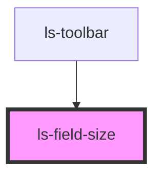

# ls-field-size

<!-- Auto Generated Below -->

## Properties

| Property   | Attribute   | Description | Type             | Default     |
| ---------- | ----------- | ----------- | ---------------- | ----------- |
| `dataItem` | `data-item` |             | `LSApiElement[]` | `undefined` |

## Events

| Event    | Description | Type                           |
| -------- | ----------- | ------------------------------ |
| `mutate` |             | `CustomEvent<LSMutateEvent[]>` |
| `update` |             | `CustomEvent<LSMutateEvent[]>` |

## Dependencies

### Used by

 - [ls-toolbar](../ls-toolbar)

### Graph

----------------------------------------------

*Built with [StencilJS](https://stenciljs.com/)*
