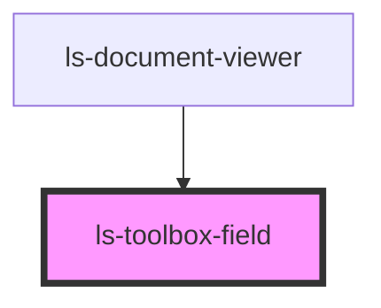

# ls-toolbox-field

<!-- Auto Generated Below -->

## Properties

| Property          | Attribute           | Description                                                                                   | Type     | Default     |
| ----------------- | ------------------- | --------------------------------------------------------------------------------------------- | -------- | ----------- |
| `defaultHeight`   | `default-height`    | The starting height of this control type in pixels.                                           | `number` | `undefined` |
| `defaultWidth`    | `default-width`     | The starting width of this control type in pixels.                                            | `number` | `undefined` |
| `elementType`     | `element-type`      |                                                                                               | `string` | `undefined` |
| `formElementType` | `form-element-type` | The field type of this toolbox item, e.g. 'signature'. Note these should always be lowercase. | `string` | `undefined` |
| `label`           | `label`             | The text to display for this field type.                                                      | `string` | `undefined` |
| `validation`      | `validation`        |                                                                                               | `number` | `0`         |

## Dependencies

### Used by

 - [ls-document-viewer](../ls-document-viewer)

### Graph

----------------------------------------------

*Built with [StencilJS](https://stenciljs.com/)*
