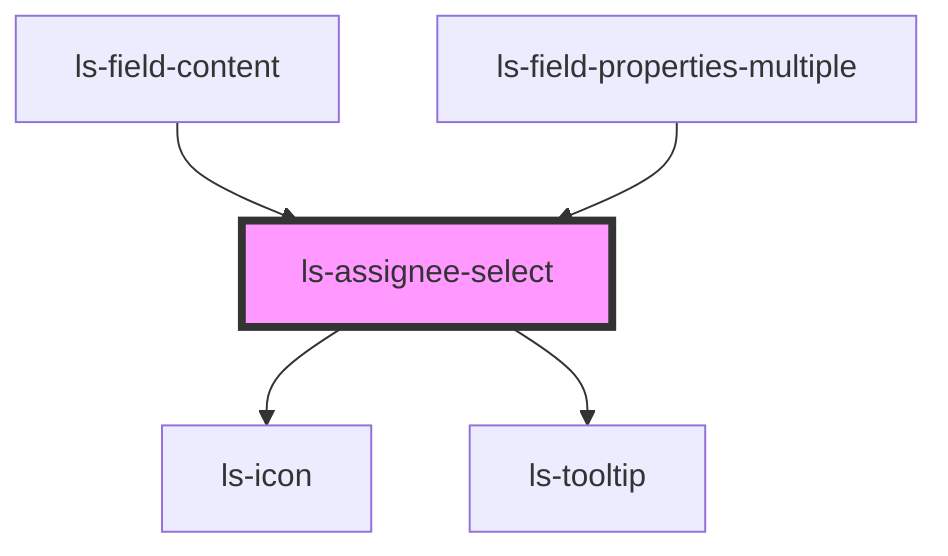

# ls-assignee-select

<!-- Auto Generated Below -->

## Properties

| Property                 | Attribute                  | Description                                                        | Type          | Default     |
| ------------------------ | -------------------------- | ------------------------------------------------------------------ | ------------- | ----------- |
| `disabled`               | `disabled`                 |                                                                    | `boolean`     | `false`     |
| `disabledApproverReason` | `disabled-approver-reason` | Tooltip reason why Approvers are disabled. Empty string = enabled. | `string`      | `''`        |
| `disabledSenderReason`   | `disabled-sender-reason`   | Tooltip reason why Sender is disabled. Empty string = enabled.     | `string`      | `''`        |
| `mixed`                  | `mixed`                    | Show mixed state (for multi-select when signers differ)            | `boolean`     | `false`     |
| `roles`                  | --                         |                                                                    | `LSApiRole[]` | `[]`        |
| `signer`                 | `signer`                   |                                                                    | `number`      | `undefined` |

## Events

| Event            | Description | Type                  |
| ---------------- | ----------- | --------------------- |
| `assigneeChange` |             | `CustomEvent<number>` |

## Dependencies

### Used by

 - [ls-field-content](../ls-field-content)
 - [ls-field-properties-multiple](../ls-field-properties-multiple)

### Depends on

- ls-icon
- ls-tooltip

### Graph

----------------------------------------------

*Built with [StencilJS](https://stenciljs.com/)*
