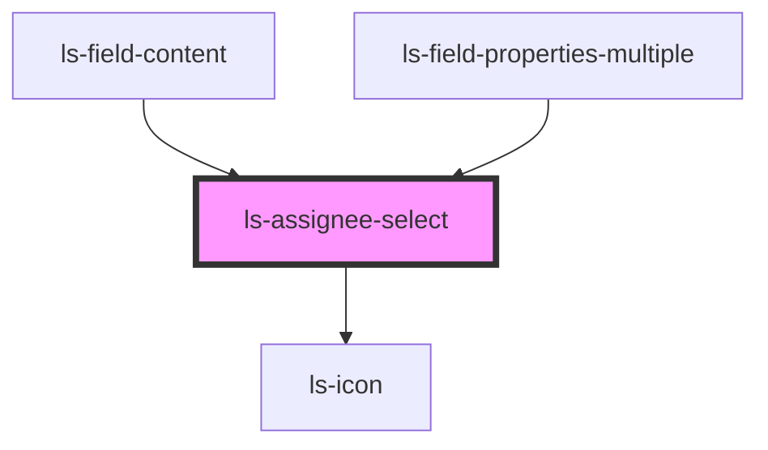

# ls-assignee-select

<!-- Auto Generated Below -->

## Properties

| Property        | Attribute        | Description                                             | Type          | Default     |
| --------------- | ---------------- | ------------------------------------------------------- | ------------- | ----------- |
| `disabled`      | `disabled`       |                                                         | `boolean`     | `false`     |
| `hideApprovers` | `hide-approvers` | Hide approver roles (e.g. for signature-type fields)    | `boolean`     | `false`     |
| `hideSender`    | `hide-sender`    | Hide Sender option (e.g. for signing date fields)       | `boolean`     | `false`     |
| `mixed`         | `mixed`          | Show mixed state (for multi-select when signers differ) | `boolean`     | `false`     |
| `roles`         | --               |                                                         | `LSApiRole[]` | `[]`        |
| `signer`        | `signer`         |                                                         | `number`      | `undefined` |

## Events

| Event            | Description | Type                  |
| ---------------- | ----------- | --------------------- |
| `assigneeChange` |             | `CustomEvent<number>` |

## Dependencies

### Used by

 - [ls-field-content](../ls-field-content)
 - [ls-field-properties-multiple](../ls-field-properties-multiple)

### Depends on

- ls-icon

### Graph

----------------------------------------------

*Built with [StencilJS](https://stenciljs.com/)*
