# ls-document-viewer

<!-- Auto Generated Below -->

## Overview

The Legalesign page viewer converted to stencil. To use pass the standard
Template information from GraphQL (see Readme).

Alex Weinle

## Properties

| Property          | Attribute         | Description                                                                                                                                                           | Type                                       | Default     |
| ----------------- | ----------------- | --------------------------------------------------------------------------------------------------------------------------------------------------------------------- | ------------------------------------------ | ----------- |
| `displayTable`    | `display-table`   | Shows the table view of fields rather than the preview. {boolean}                                                                                                     | `boolean`                                  | `false`     |
| `expandfields`    | `expandfields`    | Whether or not the fields list is expanded. {boolean}                                                                                                                 | `boolean`                                  | `false`     |
| `manager`         | `manager`         | Determines / sets which of the far left 'managers' is active. {'document' \| 'toolbox' \| 'participant' }                                                             | `"document" \| "participant" \| "toolbox"` | `'toolbox'` |
| `mode`            | `mode`            | An ease of use property that will arrange document-viewer appropraitely. {'preview' \| 'editor' \| 'custom'}                                                          | `"custom" \| "editor" \| "preview"`        | `'custom'`  |
| `pageNum`         | `page-num`        |                                                                                                                                                                       | `number`                                   | `1`         |
| `readonly`        | `readonly`        | Whether the right panel (which can be default field properties or custom panel) is displayed. {boolean}                                                               | `boolean`                                  | `false`     |
| `showpagepreview` | `showpagepreview` | Whether the page previewvertical ribbon will be shown {boolean}                                                                                                       | `boolean`                                  | `false`     |
| `showrightpanel`  | `showrightpanel`  | Whether the right panel (which can be default field properties or custom panel) is displayed. {boolean}                                                               | `boolean`                                  | `false`     |
| `showstatusbar`   | `showstatusbar`   | Whether the bottom statusbar is displayed. {boolean}                                                                                                                  | `boolean`                                  | `false`     |
| `showtableview`   | `showtableview`   | Whether the table view of the fields on this template is available to the user. {boolean}                                                                             | `boolean`                                  | `false`     |
| `showtoolbar`     | `showtoolbar`     | Whether the top toolbar is displayed. {boolean}                                                                                                                       | `boolean`                                  | `false`     |
| `showtoolbox`     | `showtoolbox`     | Whether the left hand toolbox is displayed. {boolean}                                                                                                                 | `boolean`                                  | `false`     |
| `signer`          | `signer`          |                                                                                                                                                                       | `number`                                   | `0`         |
| `template`        | `template`        | The initial template data, including the link for background PDF. See README and example for correct GraphQL query and data structure. {LSApiTemplate}                | `string`                                   | `undefined` |
| `templateid`      | `templateid`      | The id of the template you want to load (if using the internal data adapter). {string}                                                                                | `string`                                   | `undefined` |
| `token`           | `token`           | The access token of the account your want the widget to use, you should normally acquire this with a server side call using that accounts login credentials. {string} | `string`                                   | `undefined` |
| `toolboxFilter`   | `toolbox-filter`  | If supplied ONLY items in this \| ("or") delimited list will be shown. i.e. "signature\|intials" {boolean}                                                            | `string`                                   | `null`      |
| `zoom`            | `zoom`            |                                                                                                                                                                       | `number`                                   | `1.0`       |

## Events

| Event          | Description | Type                           |
| -------------- | ----------- | ------------------------------ |
| `mutate`       |             | `CustomEvent<LSMutateEvent[]>` |
| `pageChange`   |             | `CustomEvent<number>`          |
| `pageRendered` |             | `CustomEvent<number>`          |
| `selectFields` |             | `CustomEvent<LSApiElement[]>`  |
| `update`       |             | `CustomEvent<LSMutateEvent[]>` |

## Methods

### `pageNext() => Promise<void>`

Page forward
{MouseEvent} e

#### Returns

Type: `Promise<void>`

### `pagePrev() => Promise<void>`

Page backward
e

#### Returns

Type: `Promise<void>`

### `setZoom(z: number) => Promise<void>`

Page and field resize on zoom change

#### Parameters

| Name | Type     | Description |
| ---- | -------- | ----------- |
| `z`  | `number` |             |

#### Returns

Type: `Promise<void>`

## Dependencies

### Depends on

- [ls-feature-column](../ls-feature-column)
- [ls-toolbox-field](../ls-toolbox-field)
- [ls-icon](../ls-icon)
- [ls-participant-manager](../ls-participant-manager)
- [ls-document-options](../ls-document-options)
- [ls-field-properties](../ls-field-properties)
- [ls-toolbar](../ls-toolbar)
- [ls-editor-table](../ls-editor-table)
- [ls-statusbar](../ls-statusbar)
- [ls-editor-field](../ls-editor-field)

### Graph

```mermaid
graph TD;
  ls-document-viewer --> ls-feature-column
  ls-document-viewer --> ls-toolbox-field
  ls-document-viewer --> ls-icon
  ls-document-viewer --> ls-participant-manager
  ls-document-viewer --> ls-document-options
  ls-document-viewer --> ls-field-properties
  ls-document-viewer --> ls-toolbar
  ls-document-viewer --> ls-editor-table
  ls-document-viewer --> ls-statusbar
  ls-document-viewer --> ls-editor-field
  ls-feature-column --> ls-icon
  ls-toolbox-field --> ls-icon
  ls-participant-manager --> ls-icon
  ls-document-options --> ls-formfield
  ls-document-options --> ls-toggle
  ls-formfield --> ls-icon
  ls-formfield --> ls-text-input
  ls-formfield --> ls-select-input
  ls-formfield --> ls-radio-input
  ls-formfield --> ls-textarea-input
  ls-formfield --> ls-number-input
  ls-text-input --> ls-icon
  ls-select-input --> ls-icon
  ls-radio-input --> ls-icon
  ls-textarea-input --> ls-icon
  ls-number-input --> ls-icon
  ls-field-properties --> ls-field-properties-signature
  ls-field-properties --> ls-field-properties-date
  ls-field-properties --> ls-field-properties-text
  ls-field-properties --> ls-field-properties-number
  ls-field-properties --> ls-field-properties-autosign
  ls-field-properties --> ls-field-properties-email
  ls-field-properties --> ls-field-properties-image
  ls-field-properties --> ls-field-properties-file
  ls-field-properties --> ls-field-properties-general
  ls-field-properties --> ls-field-properties-multiple
  ls-field-properties-signature --> ls-field-placement
  ls-field-properties-signature --> ls-field-dimensions
  ls-field-properties-signature --> ls-field-properties-advanced
  ls-field-properties-signature --> ls-icon
  ls-field-properties-signature --> ls-toggle
  ls-field-properties-signature --> ls-field-footer
  ls-field-placement --> ls-icon
  ls-field-dimensions --> ls-icon
  ls-field-footer --> ls-icon
  ls-field-properties-date --> ls-field-properties-container
  ls-field-properties-date --> ls-field-content
  ls-field-properties-date --> ls-field-dimensions
  ls-field-properties-date --> ls-field-properties-advanced
  ls-field-properties-date --> ls-field-placement
  ls-field-properties-date --> ls-field-footer
  ls-field-content --> ls-props-section
  ls-field-content --> ls-field-type-display
  ls-field-content --> ls-toggle
  ls-field-content --> ls-input-wrapper
  ls-field-type-display --> ls-icon
  ls-input-wrapper --> ls-icon
  ls-field-properties-text --> ls-field-placement
  ls-field-properties-text --> ls-field-dimensions
  ls-field-properties-text --> ls-icon
  ls-field-properties-text --> ls-toggle
  ls-field-properties-number --> ls-field-placement
  ls-field-properties-number --> ls-field-dimensions
  ls-field-properties-number --> ls-field-properties-advanced
  ls-field-properties-number --> ls-icon
  ls-field-properties-number --> ls-toggle
  ls-field-properties-number --> ls-field-footer
  ls-field-properties-autosign --> ls-field-dimensions
  ls-field-properties-autosign --> ls-field-properties-advanced
  ls-field-properties-autosign --> ls-field-footer
  ls-field-properties-email --> ls-field-placement
  ls-field-properties-email --> ls-field-dimensions
  ls-field-properties-email --> ls-field-properties-advanced
  ls-field-properties-email --> ls-icon
  ls-field-properties-email --> ls-toggle
  ls-field-properties-email --> ls-field-footer
  ls-field-properties-image --> ls-field-placement
  ls-field-properties-image --> ls-field-dimensions
  ls-field-properties-image --> ls-field-properties-advanced
  ls-field-properties-image --> ls-icon
  ls-field-properties-image --> ls-toggle
  ls-field-properties-image --> ls-field-footer
  ls-field-properties-file --> ls-field-placement
  ls-field-properties-file --> ls-field-dimensions
  ls-field-properties-file --> ls-field-properties-advanced
  ls-field-properties-file --> ls-icon
  ls-field-properties-file --> ls-toggle
  ls-field-properties-general --> ls-field-placement
  ls-field-properties-general --> ls-field-dimensions
  ls-field-properties-general --> ls-field-properties-advanced
  ls-field-properties-general --> ls-icon
  ls-field-properties-general --> ls-toggle
  ls-field-properties-general --> ls-field-footer
  ls-field-properties-multiple --> ls-field-alignment
  ls-field-properties-multiple --> ls-field-placement
  ls-field-properties-multiple --> ls-field-distribute
  ls-field-properties-multiple --> ls-field-dimensions
  ls-field-properties-multiple --> ls-field-size
  ls-field-properties-multiple --> ls-icon
  ls-field-properties-multiple --> ls-toggle
  ls-field-properties-multiple --> ls-field-footer
  ls-field-alignment --> ls-icon
  ls-field-distribute --> ls-icon
  ls-field-size --> ls-icon
  ls-toolbar --> ls-field-format
  ls-toolbar --> ls-participant-select
  ls-field-format --> ls-icon
  ls-participant-select --> ls-icon
  ls-statusbar --> ls-icon
  style ls-document-viewer fill:#f9f,stroke:#333,stroke-width:4px
```

----------------------------------------------

*Built with [StencilJS](https://stenciljs.com/)*
