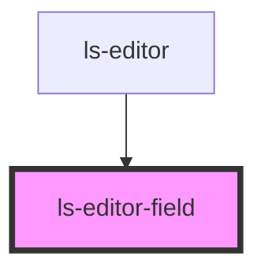

# ls-editor-field

<!-- Auto Generated Below -->

## Properties

| Property | Attribute | Description | Type                                                                             | Default     |
| -------- | --------- | ----------- | -------------------------------------------------------------------------------- | ----------- |
| `type`   | `type`    |             | `"autodate" \| "date" \| "file" \| "number" \| "regex" \| "signature" \| "text"` | `undefined` |
| `value`  | `value`   |             | `string`                                                                         | `undefined` |

## Dependencies

### Used by

 - [ls-editor](../ls-editor)

### Graph

----------------------------------------------

*Built with [StencilJS](https://stenciljs.com/)*
