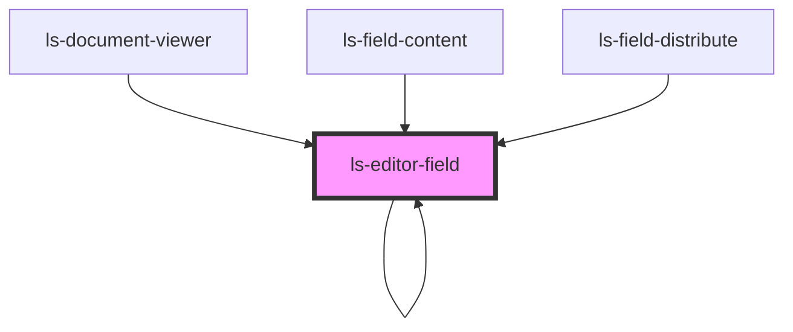

# ls-editor-field

<!-- Auto Generated Below -->

## Properties

| Property         | Attribute         | Description                                                                      | Type                                                                                                                                                                                                                                                                                                                                                                                                                                                                                                                                                                                                                                                                                                                                                                                                                                                                                   | Default     |
| ---------------- | ----------------- | -------------------------------------------------------------------------------- | -------------------------------------------------------------------------------------------------------------------------------------------------------------------------------------------------------------------------------------------------------------------------------------------------------------------------------------------------------------------------------------------------------------------------------------------------------------------------------------------------------------------------------------------------------------------------------------------------------------------------------------------------------------------------------------------------------------------------------------------------------------------------------------------------------------------------------------------------------------------------------------- | ----------- |
| `assignee`       | `assignee`        |                                                                                  | `string`                                                                                                                                                                                                                                                                                                                                                                                                                                                                                                                                                                                                                                                                                                                                                                                                                                                                               | `undefined` |
| `dataItem`       | --                |                                                                                  | `{ id: string; align: string; ax?: number; ay?: number; bx?: number; by?: number; left?: number; top?: number; height?: number; width?: number; elementType: string; fieldOrder?: number; fontName: string; fontSize: number; hideBorder?: boolean; label?: string; labelExtra?: string; helpText?: string; optional?: boolean; options?: string; page?: number; role?: LSApiRole; substantive?: boolean; validation?: number; value?: string; logicGroup?: string; logicAction?: number; mapTo?: string; signer: number; link?: string; formElementType?: "number" \| "text" \| "signature" \| "date" \| "regex" \| "file" \| "signing date" \| "autosign" \| "initials" \| "email" \| "checkbox" \| "image" \| "dropdown"; roleObject?: LSApiRole; cstyle?: any; divStyle?: any; objectHeight?: string; pageDimensions?: { height: number; width: number; }; templateId?: string; }` | `undefined` |
| `fixedAspect`    | `fixed-aspect`    |                                                                                  | `number`                                                                                                                                                                                                                                                                                                                                                                                                                                                                                                                                                                                                                                                                                                                                                                                                                                                                               | `null`      |
| `floatingActive` | `floating-active` | Controls whether floating elements are visible. Set by mouse enter/leave events. | `boolean`                                                                                                                                                                                                                                                                                                                                                                                                                                                                                                                                                                                                                                                                                                                                                                                                                                                                              | `false`     |
| `page`           | --                |                                                                                  | `{ height: number; width: number; }`                                                                                                                                                                                                                                                                                                                                                                                                                                                                                                                                                                                                                                                                                                                                                                                                                                                   | `undefined` |
| `readonly`       | `readonly`        |                                                                                  | `boolean`                                                                                                                                                                                                                                                                                                                                                                                                                                                                                                                                                                                                                                                                                                                                                                                                                                                                              | `undefined` |
| `selected`       | `selected`        |                                                                                  | `boolean`                                                                                                                                                                                                                                                                                                                                                                                                                                                                                                                                                                                                                                                                                                                                                                                                                                                                              | `false`     |
| `type`           | `type`            |                                                                                  | `"date" \| "file" \| "number" \| "regex" \| "signature" \| "signing date" \| "text"`                                                                                                                                                                                                                                                                                                                                                                                                                                                                                                                                                                                                                                                                                                                                                                                                   | `undefined` |
| `zoom`           | `zoom`            |                                                                                  | `string`                                                                                                                                                                                                                                                                                                                                                                                                                                                                                                                                                                                                                                                                                                                                                                                                                                                                               | `undefined` |

## Events

| Event    | Description | Type                           |
| -------- | ----------- | ------------------------------ |
| `mutate` |             | `CustomEvent<LSMutateEvent[]>` |
| `update` |             | `CustomEvent<LSMutateEvent[]>` |

## Dependencies

### Used by

 - [ls-document-viewer](../ls-document-viewer)
 - [ls-editor-field](.)
 - [ls-field-content](../ls-field-content)
 - [ls-field-distribute](../ls-field-distribute)

### Depends on

- [ls-icon](../ls-icon)
- [ls-editor-field](.)

### Graph

----------------------------------------------

*Built with [StencilJS](https://stenciljs.com/)*
