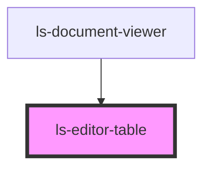

# ls-editor-table

<!-- Auto Generated Below -->

## Properties

| Property | Attribute | Description                                   | Type               | Default     |
| -------- | --------- | --------------------------------------------- | ------------------ | ----------- |
| `editor` | `editor`  | The parent editor control. {LsDocumentViewer} | `LsDocumentViewer` | `undefined` |

## Dependencies

### Used by

 - [ls-document-viewer](../ls-document-viewer)

### Graph

----------------------------------------------

*Built with [StencilJS](https://stenciljs.com/)*
