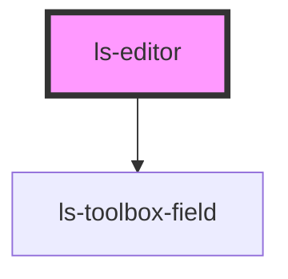

# ls-editor

<!-- Auto Generated Below -->

## Overview

The basic Legalesign page viewer converted to stencil. To use pass the standard
Template information from GraphQL (see Readme).

Alex Weinle

## Properties

| Property        | Attribute        | Description                                | Type                           | Default     |
| --------------- | ---------------- | ------------------------------------------ | ------------------------------ | ----------- |
| `initialData`   | `initial-data`   | The intial data for the template.          | `object`                       | `undefined` |
| `rotation`      | `rotation`       | Rotate the PDF in degrees {number}         | `0 \| 180 \| 270 \| 360 \| 90` | `0`         |
| `src`           | `src`            | Src of the PDF to load and render {number} | `string`                       | `undefined` |
| `templateTitle` | `template-title` | The template title                         | `string`                       | `undefined` |

## Events

| Event          | Description                                      | Type                  |
| -------------- | ------------------------------------------------ | --------------------- |
| `fieldChange`  | The field change event. Bind this to a mutation. | `CustomEvent<object>` |
| `pageChange`   |                                                  | `CustomEvent<number>` |
| `pageRendered` |                                                  | `CustomEvent<number>` |

## Methods

### `pageNext(e: MouseEvent) => Promise<void>`

Page forward
{MouseEvent} e

#### Parameters

| Name | Type         | Description |
| ---- | ------------ | ----------- |
| `e`  | `MouseEvent` |             |

#### Returns

Type: `Promise<void>`

### `pagePrev(e: MouseEvent) => Promise<void>`

Page backward
e

#### Parameters

| Name | Type         | Description |
| ---- | ------------ | ----------- |
| `e`  | `MouseEvent` |             |

#### Returns

Type: `Promise<void>`

## Dependencies

### Depends on

- [ls-toolbox-field](../ls-toolbox-field)

### Graph

----------------------------------------------

*Built with [StencilJS](https://stenciljs.com/)*
