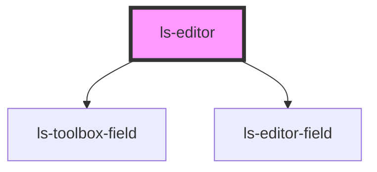

# ls-editor

<!-- Auto Generated Below -->

## Overview

The Legalesign page viewer converted to stencil. To use pass the standard
Template information from GraphQL (see Readme).

Alex Weinle

## Properties

| Property        | Attribute        | Description                                                                                                                                            | Type          | Default              |
| --------------- | ---------------- | ------------------------------------------------------------------------------------------------------------------------------------------------------ | ------------- | -------------------- |
| `roleColors`    | `role-colors`    | Allows you to change the colours used for each role in the template. {SignerColor[]}                                                                   | `RoleColor[]` | `defaultRolePalette` |
| `showtoolbox`   | `showtoolbox`    | Whether the left hand toolbox is displayed. {boolean}                                                                                                  | `boolean`     | `false`              |
| `template`      | `template`       | The initial template data, including the link for background PDF. See README and example for correct GraphQL query and data structure. {LSApiTemplate} | `string`      | `undefined`          |
| `toolboxFilter` | `toolbox-filter` | If supplied ONLY items in this \| ("or") delimited list will be shown. i.e. "signature\|intials" {boolean}                                             | `string`      | `null`               |

## Events

| Event          | Description | Type                                                                               |
| -------------- | ----------- | ---------------------------------------------------------------------------------- |
| `onChange`     |             | `CustomEvent<{ action: "update" \| "create" \| "delete"; data: LSApiElement; }[]>` |
| `onSelect`     |             | `CustomEvent<LSApiElement[]>`                                                      |
| `pageChange`   |             | `CustomEvent<number>`                                                              |
| `pageRendered` |             | `CustomEvent<number>`                                                              |

## Methods

### `pageNext(e: MouseEvent) => Promise<void>`

Page forward
{MouseEvent} e

#### Parameters

| Name | Type         | Description |
| ---- | ------------ | ----------- |
| `e`  | `MouseEvent` |             |

#### Returns

Type: `Promise<void>`

### `pagePrev(e: MouseEvent) => Promise<void>`

Page backward
e

#### Parameters

| Name | Type         | Description |
| ---- | ------------ | ----------- |
| `e`  | `MouseEvent` |             |

#### Returns

Type: `Promise<void>`

## Dependencies

### Depends on

- [ls-toolbox-field](../ls-toolbox-field)
- [ls-editor-field](../ls-editor-field)

### Graph

----------------------------------------------

*Built with [StencilJS](https://stenciljs.com/)*
