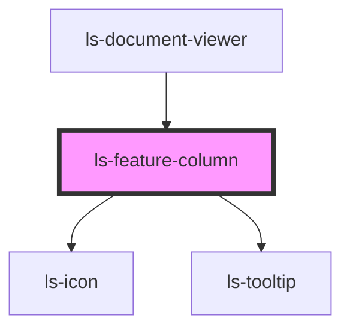

# ls-feature-column

<!-- Auto Generated Below -->

## Properties

| Property  | Attribute | Description                                                                                               | Type                                       | Default     |
| --------- | --------- | --------------------------------------------------------------------------------------------------------- | ------------------------------------------ | ----------- |
| `manager` | `manager` | Determines / sets which of the far left 'managers' is active. {'document' \| 'toolbox' \| 'participant' } | `"document" \| "participant" \| "toolbox"` | `'toolbox'` |
| `mode`    | `mode`    | The mode that document viewer is being used in. {'preview' \| 'editor' \| 'custom'}                       | `"compose" \| "editor" \| "preview"`       | `'editor'`  |

## Events

| Event    | Description | Type                                                    |
| -------- | ----------- | ------------------------------------------------------- |
| `manage` |             | `CustomEvent<"document" \| "participant" \| "toolbox">` |

## Dependencies

### Used by

 - [ls-document-viewer](../ls-document-viewer)

### Depends on

- [ls-icon](../ls-icon)
- [ls-tooltip](../ls-tooltip)

### Graph

----------------------------------------------

*Built with [StencilJS](https://stenciljs.com/)*
