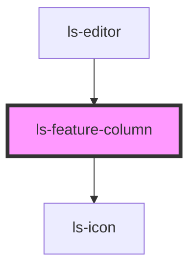

# ls-feature-column

<!-- Auto Generated Below -->

## Dependencies

### Used by

 - [ls-editor](../ls-editor)

### Depends on

- [ls-icon](../ls-icon)

### Graph

----------------------------------------------

*Built with [StencilJS](https://stenciljs.com/)*
