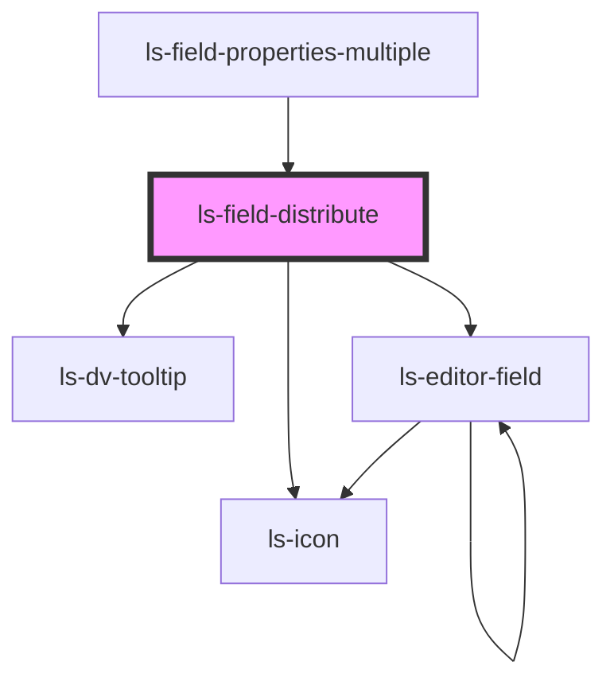

# ls-field-distribute

<!-- Auto Generated Below -->

## Properties

| Property   | Attribute | Description | Type             | Default     |
| ---------- | --------- | ----------- | ---------------- | ----------- |
| `dataItem` | --        |             | `LSApiElement[]` | `undefined` |

## Events

| Event    | Description | Type                           |
| -------- | ----------- | ------------------------------ |
| `mutate` |             | `CustomEvent<LSMutateEvent[]>` |

## Dependencies

### Used by

 - [ls-field-properties-multiple](../ls-field-properties-multiple)

### Depends on

- ls-icon
- [ls-dv-tooltip](../ls-tooltip)
- [ls-editor-field](../ls-editor-field)

### Graph

----------------------------------------------

*Built with [StencilJS](https://stenciljs.com/)*
