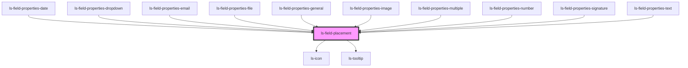

# ls-field-placement

<!-- Auto Generated Below -->

## Properties

| Property   | Attribute   | Description | Type                                                                                                                                                                                                                                                                                                                                                                                                                                                                                                                                                                                                                                                                                                                                                                                                                                                                                                 | Default     |
| ---------- | ----------- | ----------- | ---------------------------------------------------------------------------------------------------------------------------------------------------------------------------------------------------------------------------------------------------------------------------------------------------------------------------------------------------------------------------------------------------------------------------------------------------------------------------------------------------------------------------------------------------------------------------------------------------------------------------------------------------------------------------------------------------------------------------------------------------------------------------------------------------------------------------------------------------------------------------------------------------- | ----------- |
| `dataItem` | `data-item` |             | `LSApiElement[] \| { id: string; align: string; ax?: number; ay?: number; bx?: number; by?: number; left?: number; top?: number; height?: number; width?: number; elementType: string; fieldOrder?: number; fontName: string; fontSize: number; hideBorder?: boolean; label?: string; labelExtra?: string; helpText?: string; optional?: boolean; options?: string; page?: number; role?: LSApiRole; substantive?: boolean; validation?: number; value?: string; logicGroup?: string; logicAction?: number; mapTo?: string; signer: number; link?: string; formElementType?: "number" \| "text" \| "signature" \| "date" \| "regex" \| "file" \| "autodate" \| "autosign" \| "initials" \| "email" \| "checkbox" \| "image" \| "dropdown"; roleObject?: LSApiRole; cstyle?: any; divStyle?: any; objectHeight?: string; pageDimensions?: { height: number; width: number; }; templateId?: string; }` | `undefined` |

## Events

| Event    | Description | Type                           |
| -------- | ----------- | ------------------------------ |
| `mutate` |             | `CustomEvent<LSMutateEvent[]>` |
| `update` |             | `CustomEvent<LSMutateEvent[]>` |

## Dependencies

### Used by

 - [ls-field-properties-date](../ls-field-properties-date)
 - [ls-field-properties-dropdown](../ls-field-properties-dropdown)
 - [ls-field-properties-email](../ls-field-properties-email)
 - [ls-field-properties-file](../ls-field-properties-file)
 - [ls-field-properties-general](../ls-field-properties-general)
 - [ls-field-properties-image](../ls-field-properties-image)
 - [ls-field-properties-multiple](../ls-field-properties-multiple)
 - [ls-field-properties-number](../ls-field-properties-number)
 - [ls-field-properties-signature](../ls-field-properties-signature)
 - [ls-field-properties-text](../ls-field-properties-text)

### Depends on

- [ls-icon](../ls-icon)
- [ls-tooltip](../ls-tooltip)

### Graph

----------------------------------------------

*Built with [StencilJS](https://stenciljs.com/)*
