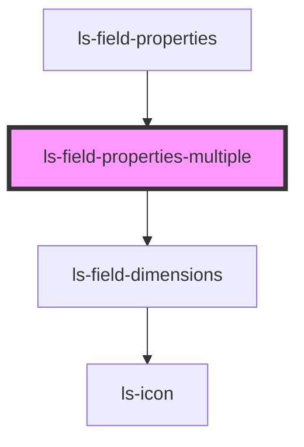

# ls-field-properties-multiple

<!-- Auto Generated Below -->

## Properties

| Property   | Attribute   | Description | Type             | Default     |
| ---------- | ----------- | ----------- | ---------------- | ----------- |
| `dataItem` | `data-item` |             | `LSApiElement[]` | `undefined` |

## Dependencies

### Used by

 - [ls-field-properties](../ls-field-properties)

### Depends on

- [ls-field-dimensions](../ls-field-dimensions)

### Graph

----------------------------------------------

*Built with [StencilJS](https://stenciljs.com/)*
