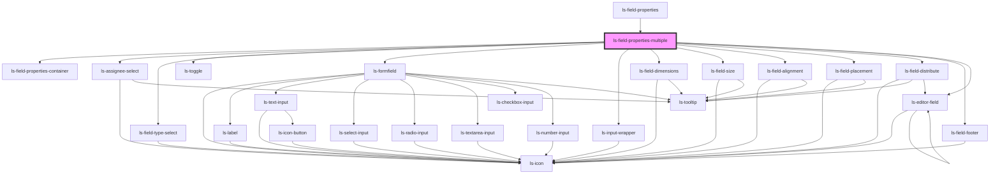

# ls-field-properties-multiple

<!-- Auto Generated Below -->

## Properties

| Property        | Attribute       | Description | Type             | Default     |
| --------------- | --------------- | ----------- | ---------------- | ----------- |
| `dataItem`      | --              |             | `LSApiElement[]` | `undefined` |
| `filtertoolbox` | `filtertoolbox` |             | `string`         | `null`      |
| `readonly`      | `readonly`      |             | `boolean`        | `false`     |
| `roles`         | --              |             | `LSApiRole[]`    | `[]`        |

## Events

| Event    | Description | Type                           |
| -------- | ----------- | ------------------------------ |
| `mutate` |             | `CustomEvent<LSMutateEvent[]>` |
| `update` |             | `CustomEvent<LSMutateEvent[]>` |

## Dependencies

### Used by

 - [ls-field-properties](../ls-field-properties)

### Depends on

- [ls-field-properties-container](../ls-field-properties-container)
- [ls-assignee-select](../ls-assignee-select)
- [ls-field-type-select](../ls-field-type-select)
- [ls-toggle](../ls-toggle)
- ls-formfield
- [ls-input-wrapper](../ls-input-wrapper)
- [ls-field-dimensions](../ls-field-dimensions)
- [ls-field-size](../ls-field-size)
- [ls-field-alignment](../ls-field-alignment)
- [ls-field-placement](../ls-field-placement)
- [ls-field-distribute](../ls-field-distribute)
- [ls-field-footer](../ls-field-footer)
- [ls-editor-field](../ls-editor-field)

### Graph

```mermaid
graph TD;
  ls-field-properties-multiple --> ls-field-properties-container
  ls-field-properties-multiple --> ls-assignee-select
  ls-field-properties-multiple --> ls-field-type-select
  ls-field-properties-multiple --> ls-toggle
  ls-field-properties-multiple --> ls-formfield
  ls-field-properties-multiple --> ls-input-wrapper
  ls-field-properties-multiple --> ls-field-dimensions
  ls-field-properties-multiple --> ls-field-size
  ls-field-properties-multiple --> ls-field-alignment
  ls-field-properties-multiple --> ls-field-placement
  ls-field-properties-multiple --> ls-field-distribute
  ls-field-properties-multiple --> ls-field-footer
  ls-field-properties-multiple --> ls-editor-field
  ls-assignee-select --> ls-icon
  ls-assignee-select --> ls-tooltip
  ls-field-type-select --> ls-icon
  ls-formfield --> ls-icon
  ls-formfield --> ls-label
  ls-formfield --> ls-text-input
  ls-formfield --> ls-select-input
  ls-formfield --> ls-radio-input
  ls-formfield --> ls-textarea-input
  ls-formfield --> ls-checkbox-input
  ls-formfield --> ls-number-input
  ls-formfield --> ls-tooltip
  ls-label --> ls-icon
  ls-text-input --> ls-icon
  ls-text-input --> ls-icon-button
  ls-icon-button --> ls-icon
  ls-select-input --> ls-icon
  ls-radio-input --> ls-icon
  ls-textarea-input --> ls-icon
  ls-number-input --> ls-icon
  ls-input-wrapper --> ls-icon
  ls-field-dimensions --> ls-icon
  ls-field-dimensions --> ls-tooltip
  ls-field-size --> ls-icon
  ls-field-size --> ls-tooltip
  ls-field-alignment --> ls-icon
  ls-field-alignment --> ls-tooltip
  ls-field-placement --> ls-icon
  ls-field-placement --> ls-tooltip
  ls-field-distribute --> ls-icon
  ls-field-distribute --> ls-tooltip
  ls-field-distribute --> ls-editor-field
  ls-editor-field --> ls-icon
  ls-editor-field --> ls-editor-field
  ls-field-footer --> ls-icon
  ls-field-properties --> ls-field-properties-multiple
  style ls-field-properties-multiple fill:#f9f,stroke:#333,stroke-width:4px
```

----------------------------------------------

*Built with [StencilJS](https://stenciljs.com/)*
