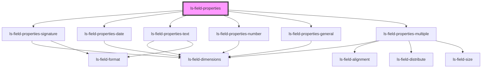

# ls-field-properties

<!-- Auto Generated Below -->

## Properties

| Property   | Attribute   | Description | Type             | Default     |
| ---------- | ----------- | ----------- | ---------------- | ----------- |
| `dataItem` | `data-item` |             | `LSApiElement[]` | `undefined` |

## Dependencies

### Depends on

- [ls-field-properties-signature](../ls-field-properties-signature)
- [ls-field-properties-date](../ls-field-properties-date)
- [ls-field-properties-text](../ls-field-properties-text)
- [ls-field-properties-number](../ls-field-properties-number)
- [ls-field-properties-general](../ls-field-properties-general)
- [ls-field-properties-multiple](../ls-field-properties-multiple)

### Graph

----------------------------------------------

*Built with [StencilJS](https://stenciljs.com/)*
