# ls-field-properties

<!-- Auto Generated Below -->

## Properties

| Property   | Attribute   | Description | Type             | Default     |
| ---------- | ----------- | ----------- | ---------------- | ----------- |
| `dataItem` | `data-item` |             | `LSApiElement[]` | `undefined` |

## Dependencies

### Used by

 - [ls-document-viewer](../ls-document-viewer)

### Depends on

- [ls-field-properties-signature](../ls-field-properties-signature)
- [ls-field-properties-date](../ls-field-properties-date)
- [ls-field-properties-text](../ls-field-properties-text)
- [ls-field-properties-number](../ls-field-properties-number)
- [ls-field-properties-autosign](../ls-field-properties-autosign)
- [ls-field-properties-email](../ls-field-properties-email)
- [ls-field-properties-image](../ls-field-properties-image)
- [ls-field-properties-file](../ls-field-properties-file)
- [ls-field-properties-general](../ls-field-properties-general)
- [ls-field-properties-multiple](../ls-field-properties-multiple)

### Graph

```mermaid
graph TD;
  ls-field-properties --> ls-field-properties-signature
  ls-field-properties --> ls-field-properties-date
  ls-field-properties --> ls-field-properties-text
  ls-field-properties --> ls-field-properties-number
  ls-field-properties --> ls-field-properties-autosign
  ls-field-properties --> ls-field-properties-email
  ls-field-properties --> ls-field-properties-image
  ls-field-properties --> ls-field-properties-file
  ls-field-properties --> ls-field-properties-general
  ls-field-properties --> ls-field-properties-multiple
  ls-field-properties-signature --> ls-field-placement
  ls-field-properties-signature --> ls-field-dimensions
  ls-field-properties-signature --> ls-icon
  ls-field-properties-signature --> ls-toggle
  ls-field-placement --> ls-icon
  ls-field-dimensions --> ls-icon
  ls-field-properties-date --> ls-field-placement
  ls-field-properties-date --> ls-field-dimensions
  ls-field-properties-date --> ls-icon
  ls-field-properties-date --> ls-toggle
  ls-field-properties-text --> ls-field-dimensions
  ls-field-properties-number --> ls-field-dimensions
  ls-field-properties-autosign --> ls-field-dimensions
  ls-field-properties-email --> ls-field-placement
  ls-field-properties-email --> ls-field-dimensions
  ls-field-properties-email --> ls-icon
  ls-field-properties-email --> ls-toggle
  ls-field-properties-image --> ls-field-dimensions
  ls-field-properties-file --> ls-field-placement
  ls-field-properties-file --> ls-field-dimensions
  ls-field-properties-file --> ls-icon
  ls-field-properties-file --> ls-toggle
  ls-field-properties-general --> ls-field-dimensions
  ls-field-properties-multiple --> ls-field-dimensions
  ls-document-viewer --> ls-field-properties
  style ls-field-properties fill:#f9f,stroke:#333,stroke-width:4px
```

----------------------------------------------

*Built with [StencilJS](https://stenciljs.com/)*
