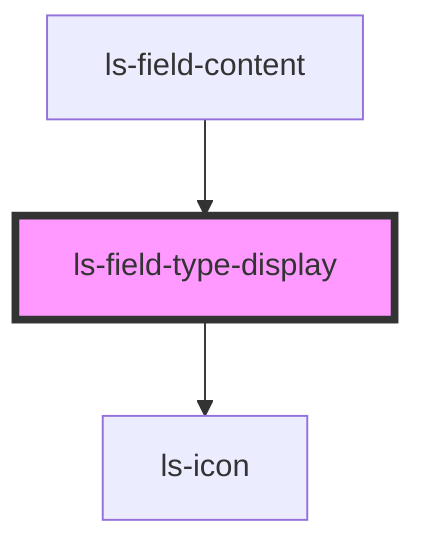

# ls-field-type-display

<!-- Auto Generated Below -->

## Properties

| Property    | Attribute    | Description | Type     | Default       |
| ----------- | ------------ | ----------- | -------- | ------------- |
| `assignee`  | `assignee`   |             | `number` | `undefined`   |
| `fieldType` | `field-type` |             | `string` | `'signature'` |

## Dependencies

### Used by

 - [ls-field-content](../ls-field-content)

### Depends on

- [ls-icon](../ls-icon)

### Graph

----------------------------------------------

*Built with [StencilJS](https://stenciljs.com/)*
