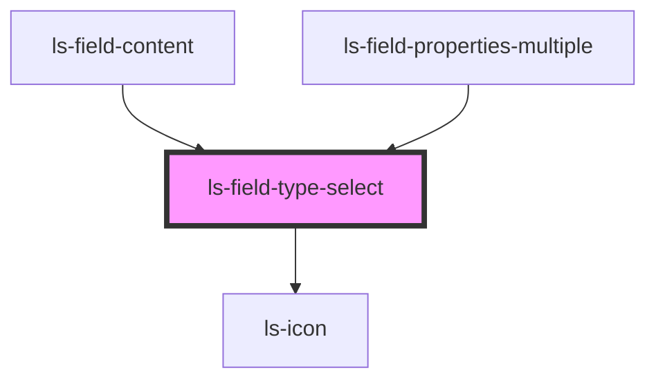

# ls-field-type-select

<!-- Auto Generated Below -->

## Properties

| Property    | Attribute    | Description                                                      | Type          | Default      |
| ----------- | ------------ | ---------------------------------------------------------------- | ------------- | ------------ |
| `assignee`  | `assignee`   | Signer index for colour                                          | `number`      | `1`          |
| `disabled`  | `disabled`   | Whether the select is disabled                                   | `boolean`     | `false`      |
| `fieldType` | `field-type` | Current field type (e.g. 'text', 'signature')                    | `string`      | `'text'`     |
| `mixed`     | `mixed`      | Show mixed state when multi-select has different field types     | `boolean`     | `false`      |
| `roleTypes` | --           | Role types of the selected field(s) — used to filter valid types | `string[]`    | `['SIGNER']` |
| `roles`     | --           | Roles from the template for determining valid types              | `LSApiRole[]` | `[]`         |

## Events

| Event             | Description | Type                  |
| ----------------- | ----------- | --------------------- |
| `fieldTypeChange` |             | `CustomEvent<string>` |

## Dependencies

### Used by

 - [ls-field-content](../ls-field-content)
 - [ls-field-properties-multiple](../ls-field-properties-multiple)

### Depends on

- ls-icon

### Graph

----------------------------------------------

*Built with [StencilJS](https://stenciljs.com/)*
