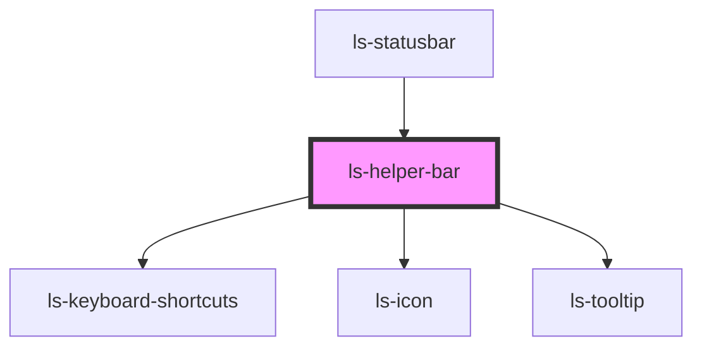

# ls-helper-bar

<!-- Auto Generated Below -->

## Properties

| Property        | Attribute        | Description | Type      | Default |
| --------------- | ---------------- | ----------- | --------- | ------- |
| `expanded`      | `expanded`       |             | `boolean` | `false` |
| `showShortcuts` | `show-shortcuts` |             | `boolean` | `false` |

## Dependencies

### Used by

 - [ls-statusbar](../ls-statusbar)

### Depends on

- [ls-keyboard-shortcuts](../ls-keyboard-shortcuts)
- [ls-icon](../ls-icon)
- [ls-tooltip](../ls-tooltip)

### Graph

----------------------------------------------

*Built with [StencilJS](https://stenciljs.com/)*
