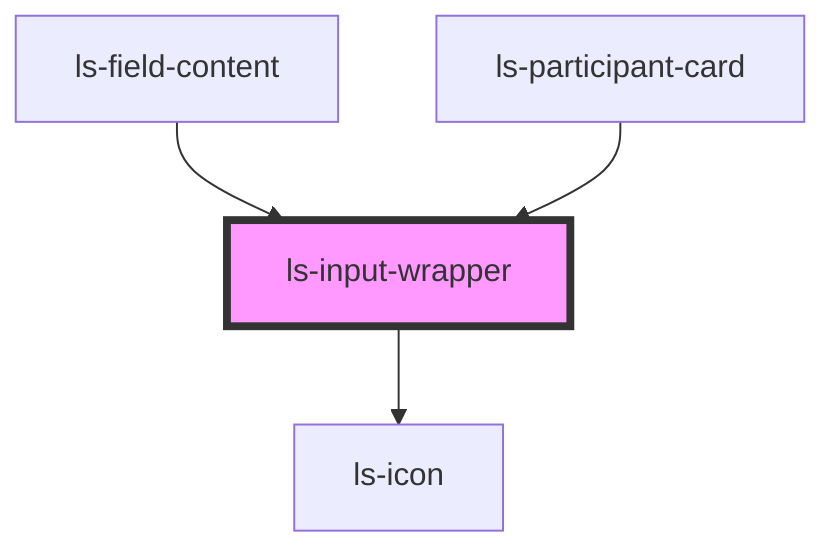

# ls-input-wrapper

<!-- Auto Generated Below -->

## Properties

| Property      | Attribute      | Description | Type      | Default     |
| ------------- | -------------- | ----------- | --------- | ----------- |
| `leadingIcon` | `leading-icon` |             | `Icon`    | `undefined` |
| `select`      | `select`       |             | `boolean` | `false`     |

## Dependencies

### Used by

 - [ls-field-content](../ls-field-content)
 - [ls-participant-card](../ls-participant-card)

### Depends on

- ls-icon

### Graph

----------------------------------------------

*Built with [StencilJS](https://stenciljs.com/)*
