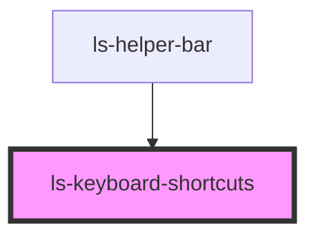

# ls-keyboard-shortcuts

<!-- Auto Generated Below -->

## Dependencies

### Used by

 - [ls-helper-bar](../ls-helper-bar)

### Graph

----------------------------------------------

*Built with [StencilJS](https://stenciljs.com/)*
