# ls-left-bar

<!-- Auto Generated Below -->

## Properties

| Property            | Attribute       | Description | Type                                                                                                                                                                                                                                                                                                                                                                                                                                                                                                                                         | Default     |
| ------------------- | --------------- | ----------- | -------------------------------------------------------------------------------------------------------------------------------------------------------------------------------------------------------------------------------------------------------------------------------------------------------------------------------------------------------------------------------------------------------------------------------------------------------------------------------------------------------------------------------------------- | ----------- |
| `displayTable`      | `display-table` |             | `boolean`                                                                                                                                                                                                                                                                                                                                                                                                                                                                                                                                    | `false`     |
| `fieldTypeSelected` | --              |             | `IToolboxField`                                                                                                                                                                                                                                                                                                                                                                                                                                                                                                                              | `undefined` |
| `filtertoolbox`     | `filtertoolbox` |             | `string`                                                                                                                                                                                                                                                                                                                                                                                                                                                                                                                                     | `null`      |
| `manager`           | `manager`       |             | `string`                                                                                                                                                                                                                                                                                                                                                                                                                                                                                                                                     | `undefined` |
| `mode`              | `mode`          |             | `"compose" \| "editor" \| "preview"`                                                                                                                                                                                                                                                                                                                                                                                                                                                                                                         | `'editor'`  |
| `recipients`        | --              |             | `any[]`                                                                                                                                                                                                                                                                                                                                                                                                                                                                                                                                      | `undefined` |
| `selected`          | --              |             | `HTMLLsEditorFieldElement[]`                                                                                                                                                                                                                                                                                                                                                                                                                                                                                                                 | `[]`        |
| `selectedDataItems` | --              |             | `any[]`                                                                                                                                                                                                                                                                                                                                                                                                                                                                                                                                      | `[]`        |
| `signer`            | `signer`        |             | `number`                                                                                                                                                                                                                                                                                                                                                                                                                                                                                                                                     | `undefined` |
| `template`          | --              |             | `{ id: string; title: string; pageCount: number; fileName: string; link: string; autoArchive: boolean; valid: boolean; locked: boolean; tags: string[]; groupId: string; roles: LSApiRole[]; canOpenSign: boolean; directLinks: []; elementConnection: { templateElements: LSApiElement[]; totalCount: number; }; elements: LSApiElement[]; createdBy: string; created: Date; modified: Date; lastSent: Date; pageDimensionArray: [number, number][]; pageDimensions: string; fixSignatureScale?: boolean; documentRetentionDays: number; }` | `undefined` |
| `validationErrors`  | --              |             | `ValidationError[]`                                                                                                                                                                                                                                                                                                                                                                                                                                                                                                                          | `[]`        |

## Events

| Event           | Description | Type                  |
| --------------- | ----------- | --------------------- |
| `clearSelected` |             | `CustomEvent<void>`   |
| `managerChange` |             | `CustomEvent<string>` |

## Dependencies

### Used by

 - [ls-document-viewer](../ls-document-viewer)

### Depends on

- [ls-icon](../ls-icon)
- [ls-field-properties](../ls-field-properties)
- [ls-toolbox-field](../ls-toolbox-field)
- [ls-feature-column](../ls-feature-column)
- [ls-participant-manager](../ls-participant-manager)
- [ls-document-options](../ls-document-options)
- [ls-validation-manager](../ls-validation-manager)
- [ls-recipient-manager](../ls-recipient-manager)
- [ls-validation-tag](../ls-validation-tag)
- [ls-recipient-card](../ls-recipient-card)

### Graph

```mermaid
graph TD;
  ls-left-bar --> ls-icon
  ls-left-bar --> ls-field-properties
  ls-left-bar --> ls-toolbox-field
  ls-left-bar --> ls-feature-column
  ls-left-bar --> ls-participant-manager
  ls-left-bar --> ls-document-options
  ls-left-bar --> ls-validation-manager
  ls-left-bar --> ls-recipient-manager
  ls-left-bar --> ls-validation-tag
  ls-left-bar --> ls-recipient-card
  ls-field-properties --> ls-field-properties-signature
  ls-field-properties --> ls-field-properties-date
  ls-field-properties --> ls-field-properties-text
  ls-field-properties --> ls-field-properties-number
  ls-field-properties --> ls-field-properties-autosign
  ls-field-properties --> ls-field-properties-email
  ls-field-properties --> ls-field-properties-image
  ls-field-properties --> ls-field-properties-file
  ls-field-properties --> ls-field-properties-general
  ls-field-properties --> ls-field-properties-multiple
  ls-field-properties-signature --> ls-field-properties-container
  ls-field-properties-signature --> ls-field-content
  ls-field-properties-signature --> ls-field-properties-advanced
  ls-field-properties-signature --> ls-field-dimensions
  ls-field-properties-signature --> ls-field-placement
  ls-field-properties-signature --> ls-field-footer
  ls-field-content --> ls-props-section
  ls-field-content --> ls-field-type-display
  ls-field-content --> ls-toggle
  ls-field-content --> ls-icon
  ls-field-content --> ls-input-wrapper
  ls-field-content --> ls-editor-field
  ls-field-type-display --> ls-icon
  ls-input-wrapper --> ls-icon
  ls-editor-field --> ls-icon
  ls-editor-field --> ls-editor-field
  ls-field-properties-advanced --> ls-icon
  ls-field-properties-advanced --> ls-props-section
  ls-field-dimensions --> ls-icon
  ls-field-dimensions --> ls-tooltip
  ls-field-placement --> ls-icon
  ls-field-placement --> ls-tooltip
  ls-field-footer --> ls-icon
  ls-field-properties-date --> ls-field-properties-container
  ls-field-properties-date --> ls-field-content
  ls-field-properties-date --> ls-field-properties-advanced
  ls-field-properties-date --> ls-field-dimensions
  ls-field-properties-date --> ls-field-placement
  ls-field-properties-date --> ls-field-footer
  ls-field-properties-text --> ls-field-properties-container
  ls-field-properties-text --> ls-field-content
  ls-field-properties-text --> ls-field-properties-advanced
  ls-field-properties-text --> ls-field-dimensions
  ls-field-properties-text --> ls-field-placement
  ls-field-properties-text --> ls-field-footer
  ls-field-properties-number --> ls-field-properties-container
  ls-field-properties-number --> ls-field-content
  ls-field-properties-number --> ls-field-properties-advanced
  ls-field-properties-number --> ls-field-dimensions
  ls-field-properties-number --> ls-field-placement
  ls-field-properties-number --> ls-field-footer
  ls-field-properties-autosign --> ls-field-dimensions
  ls-field-properties-autosign --> ls-field-properties-advanced
  ls-field-properties-autosign --> ls-field-footer
  ls-field-properties-email --> ls-field-properties-container
  ls-field-properties-email --> ls-field-content
  ls-field-properties-email --> ls-field-properties-advanced
  ls-field-properties-email --> ls-field-dimensions
  ls-field-properties-email --> ls-field-placement
  ls-field-properties-email --> ls-field-footer
  ls-field-properties-image --> ls-field-properties-container
  ls-field-properties-image --> ls-field-content
  ls-field-properties-image --> ls-field-properties-advanced
  ls-field-properties-image --> ls-field-dimensions
  ls-field-properties-image --> ls-field-placement
  ls-field-properties-image --> ls-field-footer
  ls-field-properties-file --> ls-field-properties-container
  ls-field-properties-file --> ls-field-content
  ls-field-properties-file --> ls-field-properties-advanced
  ls-field-properties-file --> ls-field-dimensions
  ls-field-properties-file --> ls-field-placement
  ls-field-properties-file --> ls-field-footer
  ls-field-properties-general --> ls-field-properties-container
  ls-field-properties-general --> ls-field-content
  ls-field-properties-general --> ls-field-properties-advanced
  ls-field-properties-general --> ls-field-dimensions
  ls-field-properties-general --> ls-field-placement
  ls-field-properties-general --> ls-field-footer
  ls-field-properties-multiple --> ls-field-properties-container
  ls-field-properties-multiple --> ls-icon
  ls-field-properties-multiple --> ls-toggle
  ls-field-properties-multiple --> ls-field-dimensions
  ls-field-properties-multiple --> ls-field-size
  ls-field-properties-multiple --> ls-field-alignment
  ls-field-properties-multiple --> ls-field-placement
  ls-field-properties-multiple --> ls-field-distribute
  ls-field-properties-multiple --> ls-field-footer
  ls-field-size --> ls-icon
  ls-field-size --> ls-tooltip
  ls-field-alignment --> ls-icon
  ls-field-alignment --> ls-tooltip
  ls-field-distribute --> ls-icon
  ls-field-distribute --> ls-tooltip
  ls-field-distribute --> ls-editor-field
  ls-toolbox-field --> ls-icon
  ls-toolbox-field --> ls-tooltip
  ls-feature-column --> ls-icon
  ls-feature-column --> ls-tooltip
  ls-participant-manager --> ls-participant-card
  ls-participant-manager --> ls-icon
  ls-participant-card --> ls-icon
  ls-participant-card --> ls-input-wrapper
  ls-participant-card --> ls-tooltip
  ls-document-options --> ls-icon
  ls-document-options --> ls-toggle
  ls-document-options --> ls-tooltip
  ls-validation-manager --> ls-toolbox-field
  ls-validation-tag --> ls-icon
  ls-recipient-card --> ls-icon
  ls-recipient-card --> ls-toolbox-field
  ls-recipient-card --> ls-tooltip
  ls-document-viewer --> ls-left-bar
  style ls-left-bar fill:#f9f,stroke:#333,stroke-width:4px
```

----------------------------------------------

*Built with [StencilJS](https://stenciljs.com/)*
