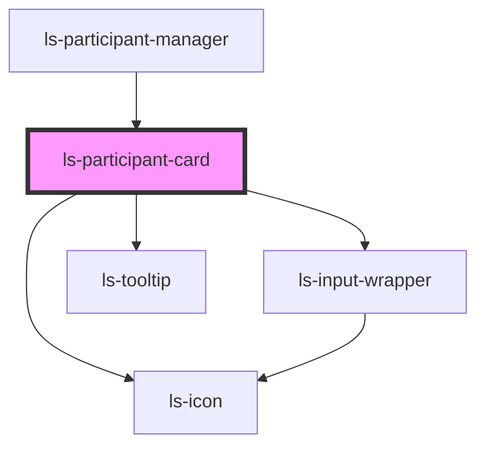

# ls-participant-card

<!-- Auto Generated Below -->

## Properties

| Property   | Attribute  | Description | Type                                                                                                                                                                                                                                                                                                                                                                                                                                                                                                                                         | Default     |
| ---------- | ---------- | ----------- | -------------------------------------------------------------------------------------------------------------------------------------------------------------------------------------------------------------------------------------------------------------------------------------------------------------------------------------------------------------------------------------------------------------------------------------------------------------------------------------------------------------------------------------------- | ----------- |
| `editable` | `editable` |             | `boolean`                                                                                                                                                                                                                                                                                                                                                                                                                                                                                                                                    | `false`     |
| `index`    | `index`    |             | `number`                                                                                                                                                                                                                                                                                                                                                                                                                                                                                                                                     | `undefined` |
| `signer`   | `signer`   |             | `{ children?: LSApiRole[]; id: string; name: string; roleType: LSApiRoleType; signerIndex: number; ordinal: number; signerParent?: string; experience: string; templateId?: string; }`                                                                                                                                                                                                                                                                                                                                                       | `undefined` |
| `template` | `template` |             | `{ id: string; title: string; pageCount: number; fileName: string; link: string; autoArchive: boolean; valid: boolean; locked: boolean; tags: string[]; groupId: string; roles: LSApiRole[]; canOpenSign: boolean; directLinks: []; elementConnection: { templateElements: LSApiElement[]; totalCount: number; }; elements: LSApiElement[]; createdBy: string; created: Date; modified: Date; lastSent: Date; pageDimensionArray: [number, number][]; pageDimensions: string; fixSignatureScale?: boolean; documentRetentionDays: number; }` | `undefined` |

## Events

| Event            | Description | Type                                                                                                                                                                                                |
| ---------------- | ----------- | --------------------------------------------------------------------------------------------------------------------------------------------------------------------------------------------------- |
| `addParticipant` |             | `CustomEvent<{ type: LSApiRoleType; parent?: string; }>`                                                                                                                                            |
| `mutate`         |             | `CustomEvent<LSMutateEvent[]>`                                                                                                                                                                      |
| `opened`         |             | `CustomEvent<{ children?: LSApiRole[]; id: string; name: string; roleType: LSApiRoleType; signerIndex: number; ordinal: number; signerParent?: string; experience: string; templateId?: string; }>` |
| `update`         |             | `CustomEvent<LSMutateEvent[]>`                                                                                                                                                                      |

## Dependencies

### Used by

 - [ls-participant-manager](../ls-participant-manager)

### Depends on

- [ls-icon](../ls-icon)
- [ls-input-wrapper](../ls-input-wrapper)
- [ls-tooltip](../ls-tooltip)

### Graph

----------------------------------------------

*Built with [StencilJS](https://stenciljs.com/)*
