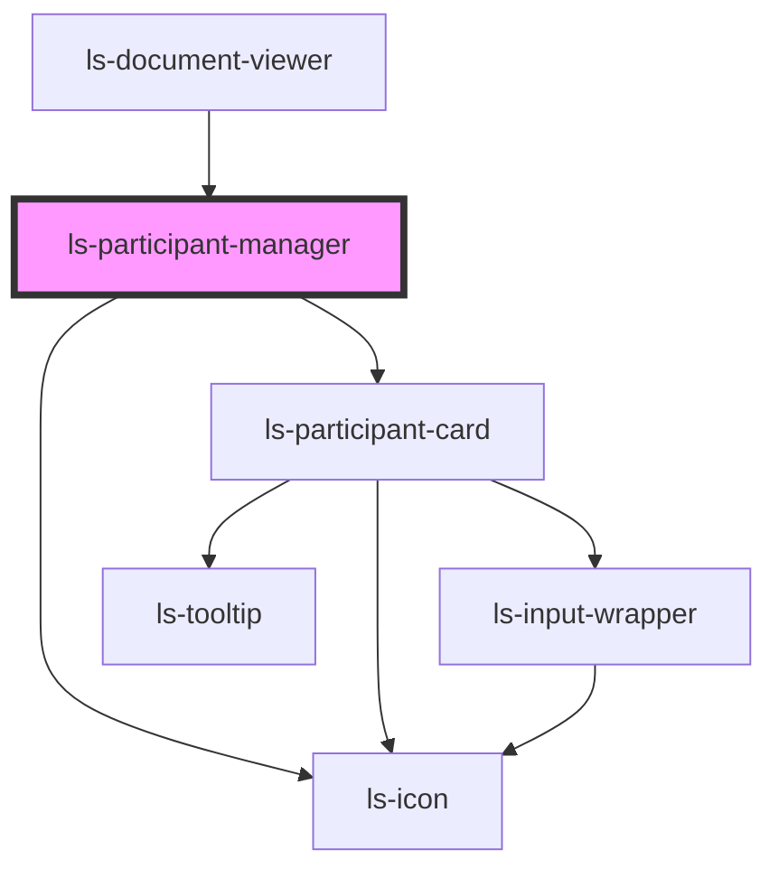

# ls-participant-manager

<!-- Auto Generated Below -->

## Properties

| Property   | Attribute | Description                                              | Type                                                                                                                                                                                                                                                                                                                                                                                                                                                                                                                                         | Default     |
| ---------- | --------- | -------------------------------------------------------- | -------------------------------------------------------------------------------------------------------------------------------------------------------------------------------------------------------------------------------------------------------------------------------------------------------------------------------------------------------------------------------------------------------------------------------------------------------------------------------------------------------------------------------------------- | ----------- |
| `editor`   | --        | The base editor. {LSDocumentViewer}                      | `LsDocumentViewer`                                                                                                                                                                                                                                                                                                                                                                                                                                                                                                                           | `undefined` |
| `template` | --        | The base template information (as JSON). {LSApiTemplate} | `{ id: string; title: string; pageCount: number; fileName: string; link: string; autoArchive: boolean; valid: boolean; locked: boolean; tags: string[]; groupId: string; roles: LSApiRole[]; canOpenSign: boolean; directLinks: []; elementConnection: { templateElements: LSApiElement[]; totalCount: number; }; elements: LSApiElement[]; createdBy: string; created: Date; modified: Date; lastSent: Date; pageDimensionArray: [number, number][]; pageDimensions: string; fixSignatureScale?: boolean; documentRetentionDays: number; }` | `undefined` |

## Events

| Event            | Description | Type                                                     |
| ---------------- | ----------- | -------------------------------------------------------- |
| `addParticipant` |             | `CustomEvent<{ type: LSApiRoleType; parent?: string; }>` |
| `mutate`         |             | `CustomEvent<LSMutateEvent[]>`                           |
| `update`         |             | `CustomEvent<LSMutateEvent[]>`                           |

## Dependencies

### Used by

 - [ls-document-viewer](../ls-document-viewer)

### Depends on

- [ls-participant-card](../ls-participant-card)
- [ls-icon](../ls-icon)

### Graph

----------------------------------------------

*Built with [StencilJS](https://stenciljs.com/)*
