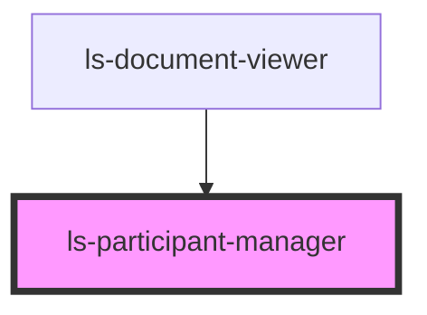

# ls-participant-manager

<!-- Auto Generated Below -->

## Properties

| Property   | Attribute  | Description                                              | Type                                                                                                                                                                                                                                                                                                                                                                                                                                                                                                          | Default     |
| ---------- | ---------- | -------------------------------------------------------- | ------------------------------------------------------------------------------------------------------------------------------------------------------------------------------------------------------------------------------------------------------------------------------------------------------------------------------------------------------------------------------------------------------------------------------------------------------------------------------------------------------------- | ----------- |
| `template` | `template` | The base template information (as JSON). {LSApiTemplate} | `{ id: string; title: string; pageCount: number; fileName: string; link: string; autoArchive: boolean; valid: boolean; locked: boolean; tags: string[]; groupId: string; roles: LSApiRole[]; canOpenSign: boolean; directLinks: []; elementConnection: { templateElements: LSApiElement[]; totalCount: number; }; elements: LSApiElement[]; createdBy: string; created: Date; modified: Date; lastSent: Date; pageDimensionArray: [number, number][]; pageDimensions: string; fixSignatureScale?: boolean; }` | `undefined` |

## Dependencies

### Used by

 - [ls-document-viewer](../ls-document-viewer)

### Graph

----------------------------------------------

*Built with [StencilJS](https://stenciljs.com/)*
