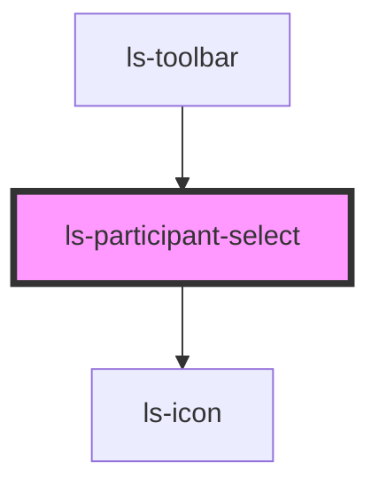

# ls-participant-select

<!-- Auto Generated Below -->

## Properties

| Property   | Attribute  | Description                                     | Type          | Default     |
| ---------- | ---------- | ----------------------------------------------- | ------------- | ----------- |
| `roles`    | `roles`    | The current template roles. {LSApiRole}         | `LSApiRole[]` | `[]`        |
| `selected` | `selected` | The id of the currently selected role. {string} | `string`      | `undefined` |

## Events

| Event            | Description | Type                                                     |
| ---------------- | ----------- | -------------------------------------------------------- |
| `addParticipant` |             | `CustomEvent<{ type: LSApiRoleType; parent?: string; }>` |
| `roleChange`     |             | `CustomEvent<number>`                                    |

## Dependencies

### Used by

 - [ls-toolbar](../ls-toolbar)

### Depends on

- [ls-icon](../ls-icon)

### Graph

----------------------------------------------

*Built with [StencilJS](https://stenciljs.com/)*
