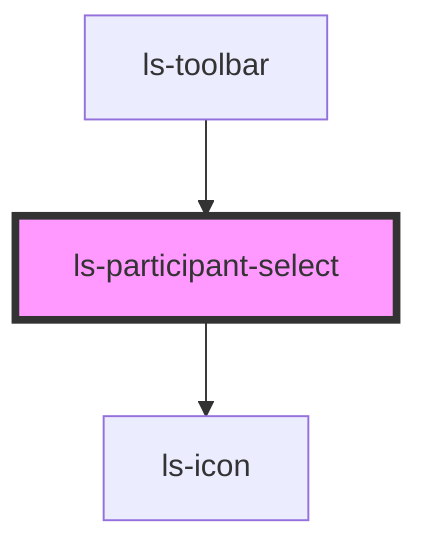

# ls-participant-select

<!-- Auto Generated Below -->

## Properties

| Property   | Attribute   | Description                             | Type             | Default     |
| ---------- | ----------- | --------------------------------------- | ---------------- | ----------- |
| `dataItem` | `data-item` |                                         | `LSApiElement[]` | `undefined` |
| `roles`    | `roles`     | The current template roles. {LSApiRole} | `LSApiRole[]`    | `[]`        |
| Property       | Attribute       | Description                             | Type             | Default     |
| -------------- | --------------- | --------------------------------------- | ---------------- | ----------- |
| `dataItem`     | `data-item`     |                                         | `LSApiElement[]` | `undefined` |
| `roles`        | `roles`         | The current template roles. {LSApiRole} | `LSApiRole[]`    | `[]`        |
| `selectedRole` | `selected-role` | The currently selected role. {number}   | `number`         | `0`         |

## Events

| Event         | Description | Type                           |
| ------------- | ----------- | ------------------------------ |
| `mutate`      |             | `CustomEvent<LSMutateEvent[]>` |
| `roleChanged` |             | `CustomEvent<number>`          |
| `update`      |             | `CustomEvent<LSMutateEvent[]>` |
| Event    | Description | Type                           |
| -------- | ----------- | ------------------------------ |
| `mutate` |             | `CustomEvent<LSMutateEvent[]>` |
| `update` |             | `CustomEvent<LSMutateEvent[]>` |

## Dependencies

### Used by

 - [ls-toolbar](../ls-toolbar)

### Depends on

- [ls-icon](../ls-icon)

### Graph

----------------------------------------------

*Built with [StencilJS](https://stenciljs.com/)*
