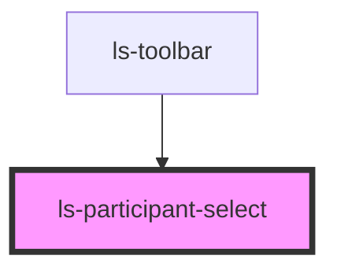

# ls-participant-select

<!-- Auto Generated Below -->

## Properties

| Property       | Attribute       | Description                             | Type          | Default |
| -------------- | --------------- | --------------------------------------- | ------------- | ------- |
| `roles`        | `roles`         | The current template roles. {LSApiRole} | `LSApiRole[]` | `[]`    |
| `selectedRole` | `selected-role` | The currently selected role. {number}   | `number`      | `0`     |

## Events

| Event        | Description | Type                  |
| ------------ | ----------- | --------------------- |
| `changeRole` |             | `CustomEvent<number>` |

## Dependencies

### Used by

 - [ls-toolbar](../ls-toolbar)

### Graph

----------------------------------------------

*Built with [StencilJS](https://stenciljs.com/)*
