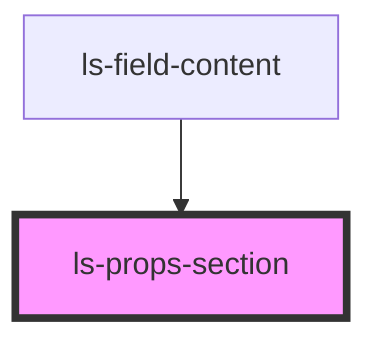

# ls-props-section

<!-- Auto Generated Below -->

## Properties

| Property             | Attribute             | Description | Type      | Default     |
| -------------------- | --------------------- | ----------- | --------- | ----------- |
| `row`                | `row`                 |             | `boolean` | `false`     |
| `sectionDescription` | `section-description` |             | `string`  | `undefined` |
| `sectionTitle`       | `section-title`       |             | `string`  | `undefined` |

## Dependencies

### Used by

 - [ls-field-content](../ls-field-content)

### Graph

----------------------------------------------

*Built with [StencilJS](https://stenciljs.com/)*
