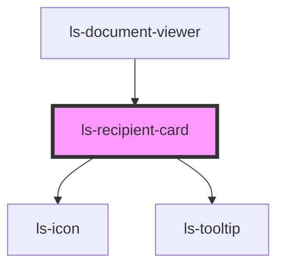

# ls-recipient-card

<!-- Auto Generated Below -->

## Properties

| Property    | Attribute   | Description                                                                                                                                            | Type                                                                                                                                                           | Default     |
| ----------- | ----------- | ------------------------------------------------------------------------------------------------------------------------------------------------------ | -------------------------------------------------------------------------------------------------------------------------------------------------------------- | ----------- |
| `recipient` | `recipient` | The initial template data, including the link for background PDF. See README and example for correct GraphQL query and data structure. {LSApiTemplate} | `{ name: string; email: string; firstname: string; lastname: string; signerIndex?: number; roleType?: "SIGNER" \| "APPROVER" \| "WITNESS" \| "FORM_FILLER"; }` | `undefined` |

## Dependencies

### Used by

 - [ls-document-viewer](../ls-document-viewer)

### Depends on

- [ls-icon](../ls-icon)
- [ls-tooltip](../ls-tooltip)

### Graph

----------------------------------------------

*Built with [StencilJS](https://stenciljs.com/)*
