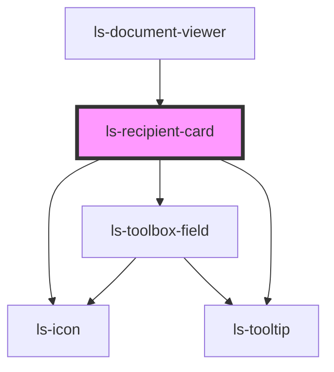

# ls-recipient-card

<!-- Auto Generated Below -->

## Properties

| Property            | Attribute          | Description                                                                                                                                            | Type                                                                                                                                                                                                                                                                                                                                                                                                                                                                                                                                         | Default                                                                                                                                                          |
| ------------------- | ------------------ | ------------------------------------------------------------------------------------------------------------------------------------------------------ | -------------------------------------------------------------------------------------------------------------------------------------------------------------------------------------------------------------------------------------------------------------------------------------------------------------------------------------------------------------------------------------------------------------------------------------------------------------------------------------------------------------------------------------------- | ---------------------------------------------------------------------------------------------------------------------------------------------------------------- |
| `activeRecipient`   | `active-recipient` |                                                                                                                                                        | `number`                                                                                                                                                                                                                                                                                                                                                                                                                                                                                                                                     | `undefined`                                                                                                                                                      |
| `fieldTypeSelected` | --                 |                                                                                                                                                        | `IToolboxField`                                                                                                                                                                                                                                                                                                                                                                                                                                                                                                                              | `{     label: 'Signature',     formElementType: 'signature',     elementType: 'signature',     validation: 0,     defaultHeight: 27,     defaultWidth: 120,   }` |
| `filtertoolbox`     | `filtertoolbox`    | Allows the selection of fields in the toolbox to be limited to a \| (pipe) delimited list. {string}                                                    | `string`                                                                                                                                                                                                                                                                                                                                                                                                                                                                                                                                     | `null`                                                                                                                                                           |
| `recipient`         | --                 | The initial template data, including the link for background PDF. See README and example for correct GraphQL query and data structure. {LSApiTemplate} | `{ name: string; email: string; firstName: string; lastName: string; signerIndex?: number; phone?: string; previousRecipientDecides?: boolean; roleType?: "SIGNER" \| "APPROVER" \| "WITNESS" \| "FORM_FILLER"; }`                                                                                                                                                                                                                                                                                                                           | `undefined`                                                                                                                                                      |
| `template`          | --                 |                                                                                                                                                        | `{ id: string; title: string; pageCount: number; fileName: string; link: string; autoArchive: boolean; valid: boolean; locked: boolean; tags: string[]; groupId: string; roles: LSApiRole[]; canOpenSign: boolean; directLinks: []; elementConnection: { templateElements: LSApiElement[]; totalCount: number; }; elements: LSApiElement[]; createdBy: string; created: Date; modified: Date; lastSent: Date; pageDimensionArray: [number, number][]; pageDimensions: string; fixSignatureScale?: boolean; documentRetentionDays: number; }` | `undefined`                                                                                                                                                      |
| `validationErrors`  | --                 |                                                                                                                                                        | `ValidationError[]`                                                                                                                                                                                                                                                                                                                                                                                                                                                                                                                          | `[]`                                                                                                                                                             |

## Events

| Event           | Description | Type                         |
| --------------- | ----------- | ---------------------------- |
| `changeSigner`  |             | `CustomEvent<number>`        |
| `fieldSelected` |             | `CustomEvent<IToolboxField>` |

## Dependencies

### Used by

 - [ls-document-viewer](../ls-document-viewer)

### Depends on

- [ls-icon](../ls-icon)
- [ls-toolbox-field](../ls-toolbox-field)
- [ls-tooltip](../ls-tooltip)

### Graph

----------------------------------------------

*Built with [StencilJS](https://stenciljs.com/)*
