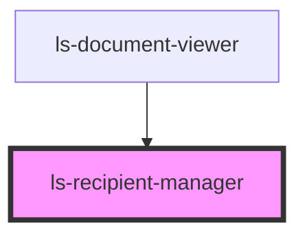

# ls-recipient-manager

<!-- Auto Generated Below -->

## Dependencies

### Used by

 - [ls-document-viewer](../ls-document-viewer)

### Graph

----------------------------------------------

*Built with [StencilJS](https://stenciljs.com/)*
