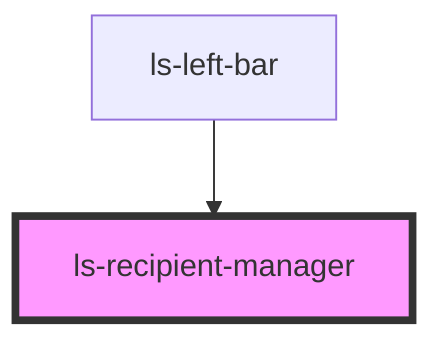

# ls-recipient-manager

<!-- Auto Generated Below -->

## Dependencies

### Used by

 - [ls-left-bar](../ls-left-bar)

### Graph

```mermaid
graph TD;
  ls-left-bar --> ls-recipient-manager
  style ls-recipient-manager fill:#f9f,stroke:#333,stroke-width:4px
```

----------------------------------------------

*Built with [StencilJS](https://stenciljs.com/)*
