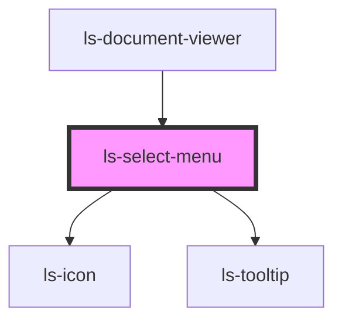

# ls-select-menu

<!-- Auto Generated Below -->

## Properties

| Property   | Attribute  | Description | Type     | Default     |
| ---------- | ---------- | ----------- | -------- | ----------- |
| `editor`   | `editor`   |             | `any`    | `undefined` |
| `pageNum`  | `page-num` |             | `number` | `undefined` |
| `selected` | --         |             | `any[]`  | `[]`        |

## Events

| Event          | Description | Type                 |
| -------------- | ----------- | -------------------- |
| `selectFields` |             | `CustomEvent<any[]>` |

## Dependencies

### Used by

 - [ls-document-viewer](../ls-document-viewer)

### Depends on

- ls-icon
- ls-tooltip

### Graph

----------------------------------------------

*Built with [StencilJS](https://stenciljs.com/)*
