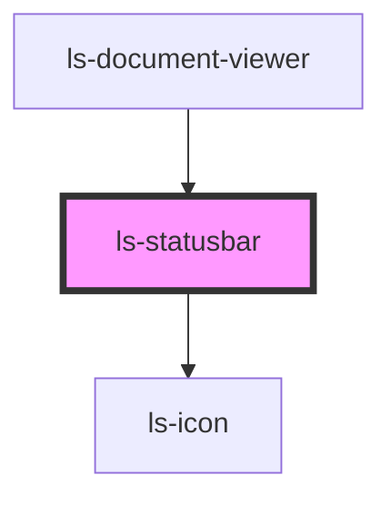

# ls-statusbar

<!-- Auto Generated Below -->

## Properties

| Property | Attribute | Description                                    | Type               | Default     |
| -------- | --------- | ---------------------------------------------- | ------------------ | ----------- |
| `editor` | `editor`  | The zoom or scale level 100 === 100%. {number} | `LsDocumentViewer` | `undefined` |

## Dependencies

### Used by

 - [ls-document-viewer](../ls-document-viewer)

### Depends on

- [ls-icon](../ls-icon)

### Graph

----------------------------------------------

*Built with [StencilJS](https://stenciljs.com/)*
