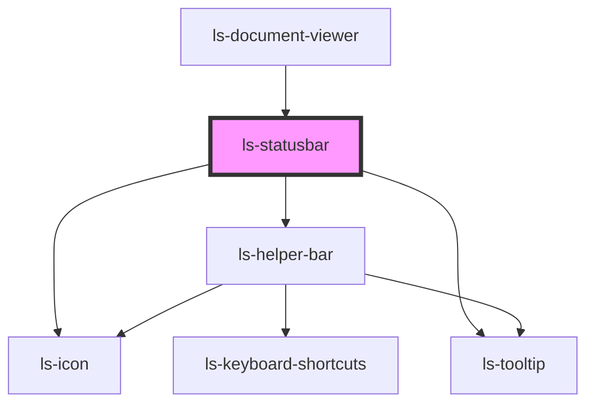

# ls-statusbar

<!-- Auto Generated Below -->

## Properties

| Property    | Attribute    | Description                                           | Type                                 | Default     |
| ----------- | ------------ | ----------------------------------------------------- | ------------------------------------ | ----------- |
| `editor`    | --           | The parent editor control. {LsDocumentViewer}         | `LsDocumentViewer`                   | `undefined` |
| `mode`      | `mode`       | The viewer mode. {'preview' \| 'editor' \| 'compose'} | `"compose" \| "editor" \| "preview"` | `'editor'`  |
| `page`      | `page`       |                                                       | `number`                             | `undefined` |
| `pageCount` | `page-count` |                                                       | `number`                             | `undefined` |
| `zoom`      | `zoom`       | The zoom or scale level 100 === 100%. {number}        | `number`                             | `undefined` |

## Dependencies

### Used by

 - [ls-document-viewer](../ls-document-viewer)

### Depends on

- ls-icon
- [ls-helper-bar](../ls-helper-bar)
- ls-tooltip

### Graph

```mermaid
graph TD;
  ls-statusbar --> ls-icon
  ls-statusbar --> ls-helper-bar
  ls-statusbar --> ls-tooltip
  ls-helper-bar --> ls-keyboard-shortcuts
  ls-helper-bar --> ls-icon
  ls-helper-bar --> ls-tooltip
  ls-document-viewer --> ls-statusbar
  style ls-statusbar fill:#f9f,stroke:#333,stroke-width:4px
```

----------------------------------------------

*Built with [StencilJS](https://stenciljs.com/)*
