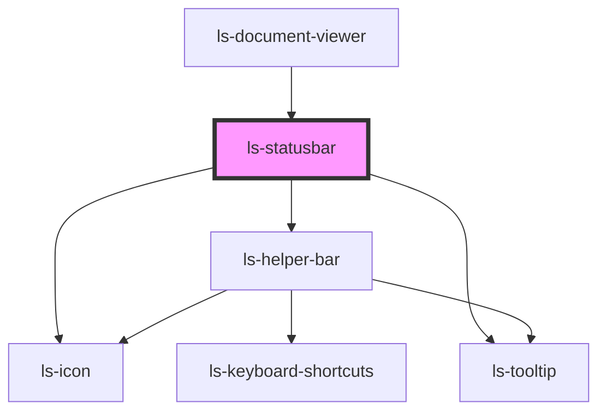

# ls-statusbar

<!-- Auto Generated Below -->

## Properties

| Property    | Attribute    | Description                                    | Type               | Default     |
| ----------- | ------------ | ---------------------------------------------- | ------------------ | ----------- |
| `editor`    | --           | The parent editor control. {LsDocumentViewer}  | `LsDocumentViewer` | `undefined` |
| `page`      | `page`       |                                                | `number`           | `undefined` |
| `pageCount` | `page-count` |                                                | `number`           | `undefined` |
| `zoom`      | `zoom`       | The zoom or scale level 100 === 100%. {number} | `number`           | `undefined` |

## Dependencies

### Used by

 - [ls-document-viewer](../ls-document-viewer)

### Depends on

- [ls-icon](../ls-icon)
- [ls-helper-bar](../ls-helper-bar)
- [ls-tooltip](../ls-tooltip)

### Graph

----------------------------------------------

*Built with [StencilJS](https://stenciljs.com/)*
