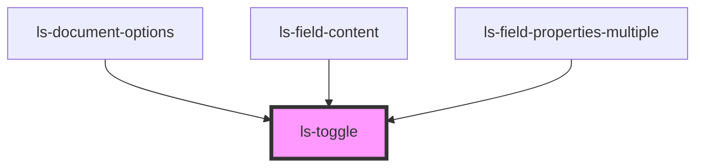

# ls-toggle

<!-- Auto Generated Below -->

## Properties

| Property  | Attribute | Description | Type      | Default     |
| --------- | --------- | ----------- | --------- | ----------- |
| `checked` | `checked` |             | `boolean` | `undefined` |
| `value`   | `value`   |             | `string`  | `undefined` |

## Events

| Event         | Description | Type                   |
| ------------- | ----------- | ---------------------- |
| `valueChange` |             | `CustomEvent<boolean>` |

## Dependencies

### Used by

 - [ls-document-options](../ls-document-options)
 - [ls-field-content](../ls-field-content)
 - [ls-field-properties-multiple](../ls-field-properties-multiple)

### Graph

----------------------------------------------

*Built with [StencilJS](https://stenciljs.com/)*
