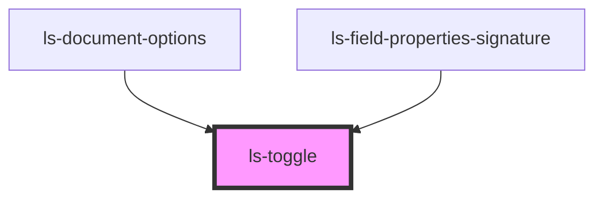

# ls-toggle

<!-- Auto Generated Below -->

## Dependencies

### Used by

 - [ls-document-options](../ls-document-options)
 - [ls-field-properties-signature](../ls-field-properties-signature)

### Graph

----------------------------------------------

*Built with [StencilJS](https://stenciljs.com/)*
