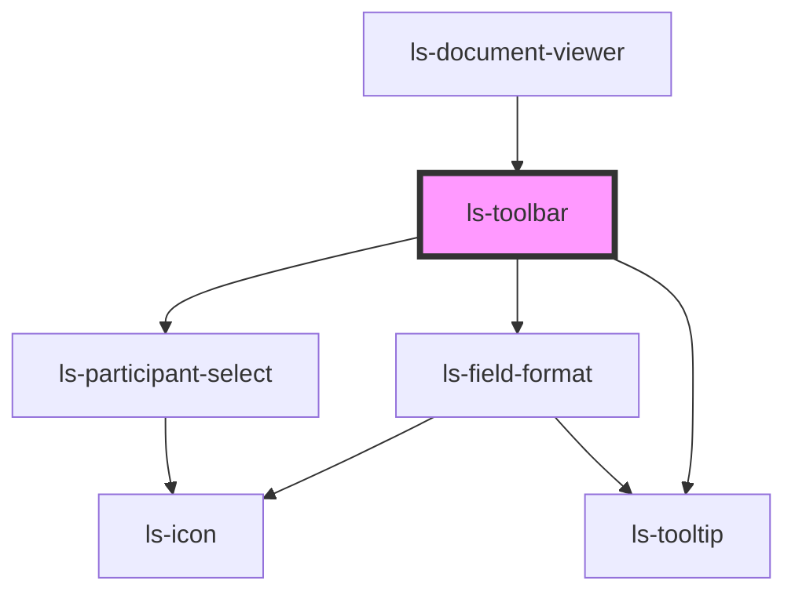

# ls-toolbar

<!-- Auto Generated Below -->

## Properties

| Property    | Attribute | Description                                                | Type                                                                                                                                                                                                                                                                                                                                                                                                                                                                                                                                         | Default     |
| ----------- | --------- | ---------------------------------------------------------- | -------------------------------------------------------------------------------------------------------------------------------------------------------------------------------------------------------------------------------------------------------------------------------------------------------------------------------------------------------------------------------------------------------------------------------------------------------------------------------------------------------------------------------------------- | ----------- |
| `dataItem`  | --        | The selected items information (as JSON). {LSApiElement[]} | `LSApiElement[]`                                                                                                                                                                                                                                                                                                                                                                                                                                                                                                                             | `undefined` |
| `editor`    | --        | The main editor. {LSDocumentViewer}                        | `LsDocumentViewer`                                                                                                                                                                                                                                                                                                                                                                                                                                                                                                                           | `undefined` |
| `groupInfo` | --        | The group and experience information. {object}             | `object`                                                                                                                                                                                                                                                                                                                                                                                                                                                                                                                                     | `undefined` |
| `template`  | --        | The base template information (as JSON). {LSApiTemplate}   | `{ id: string; title: string; pageCount: number; fileName: string; link: string; autoArchive: boolean; valid: boolean; locked: boolean; tags: string[]; groupId: string; roles: LSApiRole[]; canOpenSign: boolean; directLinks: []; elementConnection: { templateElements: LSApiElement[]; totalCount: number; }; elements: LSApiElement[]; createdBy: string; created: Date; modified: Date; lastSent: Date; pageDimensionArray: [number, number][]; pageDimensions: string; fixSignatureScale?: boolean; documentRetentionDays: number; }` | `undefined` |

## Events

| Event    | Description | Type                           |
| -------- | ----------- | ------------------------------ |
| `mutate` |             | `CustomEvent<LSMutateEvent[]>` |
| `update` |             | `CustomEvent<LSMutateEvent[]>` |

## Dependencies

### Used by

 - [ls-document-viewer](../ls-document-viewer)

### Depends on

- [ls-field-format](../ls-field-format)
- [ls-participant-select](../ls-participant-select)
- [ls-tooltip](../ls-tooltip)

### Graph

----------------------------------------------

*Built with [StencilJS](https://stenciljs.com/)*
