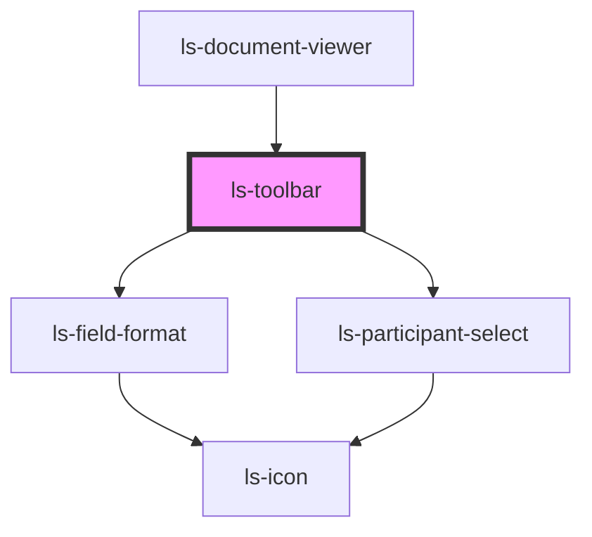

# ls-toolbar

<!-- Auto Generated Below -->

## Properties

| Property   | Attribute   | Description                                                 | Type                                                                                                                                                                                                                                                                                                                                                                                                                                                                                                          | Default     |
| ---------- | ----------- | ----------------------------------------------------------- | ------------------------------------------------------------------------------------------------------------------------------------------------------------------------------------------------------------------------------------------------------------------------------------------------------------------------------------------------------------------------------------------------------------------------------------------------------------------------------------------------------------- | ----------- |
| `dataItem` | `data-item` | The selected items information (as JSON). {LSApiElement[]}  | `LSApiElement[]`                                                                                                                                                                                                                                                                                                                                                                                                                                                                                              | `undefined` |
| `editor`   | `editor`    | The base template information (as JSON). {LSDocumentViewer} | `LsDocumentViewer`                                                                                                                                                                                                                                                                                                                                                                                                                                                                                            | `undefined` |
| `template` | `template`  | The base template information (as JSON). {LSApiTemplate}    | `{ id: string; title: string; pageCount: number; fileName: string; link: string; autoArchive: boolean; valid: boolean; locked: boolean; tags: string[]; groupId: string; roles: LSApiRole[]; canOpenSign: boolean; directLinks: []; elementConnection: { templateElements: LSApiElement[]; totalCount: number; }; elements: LSApiElement[]; createdBy: string; created: Date; modified: Date; lastSent: Date; pageDimensionArray: [number, number][]; pageDimensions: string; fixSignatureScale?: boolean; }` | `undefined` |

## Events

| Event    | Description | Type                           |
| -------- | ----------- | ------------------------------ |
| `mutate` |             | `CustomEvent<LSMutateEvent[]>` |
| `update` |             | `CustomEvent<LSMutateEvent[]>` |

## Dependencies

### Used by

 - [ls-document-viewer](../ls-document-viewer)

### Depends on

- [ls-field-format](../ls-field-format)
- [ls-participant-select](../ls-participant-select)

### Graph

----------------------------------------------

*Built with [StencilJS](https://stenciljs.com/)*
