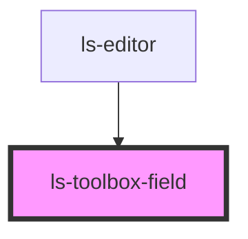

# ls-toolbox-field

<!-- Auto Generated Below -->

## Properties

| Property | Attribute | Description                                | Type     | Default     |
| -------- | --------- | ------------------------------------------ | -------- | ----------- |
| `value`  | `value`   | Src of the PDF to load and render {number} | `string` | `undefined` |

## Dependencies

### Used by

 - [ls-editor](../ls-editor)

### Graph

----------------------------------------------

*Built with [StencilJS](https://stenciljs.com/)*
