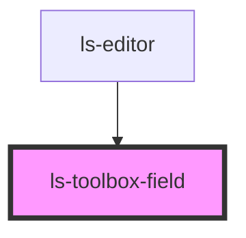

# ls-toolbox-field

<!-- Auto Generated Below -->

## Properties

| Property        | Attribute        | Description                                                                                   | Type     | Default     |
| --------------- | ---------------- | --------------------------------------------------------------------------------------------- | -------- | ----------- |
| `defaultHeight` | `default-height` | The starting height of this control type in pixels.                                           | `number` | `undefined` |
| `defaultWidth`  | `default-width`  | The starting width of this control type in pixels.                                            | `number` | `undefined` |
| `label`         | `label`          | The text to display for this field type.                                                      | `string` | `undefined` |
| `type`          | `type`           | The field type of this toolbox item, e.g. 'signature'. Note these should always be lowercase. | `string` | `undefined` |

## Dependencies

### Used by

 - [ls-editor](../ls-editor)

### Graph

----------------------------------------------

*Built with [StencilJS](https://stenciljs.com/)*
