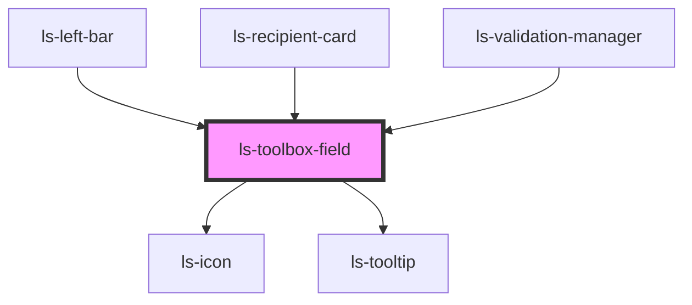

# ls-toolbox-field

<!-- Auto Generated Below -->

## Properties

| Property          | Attribute           | Description                                                                                   | Type                                             | Default     |
| ----------------- | ------------------- | --------------------------------------------------------------------------------------------- | ------------------------------------------------ | ----------- |
| `defaultHeight`   | `default-height`    | The starting height of this control type in pixels.                                           | `number`                                         | `undefined` |
| `defaultWidth`    | `default-width`     | The starting width of this control type in pixels.                                            | `number`                                         | `undefined` |
| `elementType`     | `element-type`      |                                                                                               | `"admin" \| "initials" \| "signature" \| "text"` | `undefined` |
| `fixedAspect`     | `fixed-aspect`      |                                                                                               | `number`                                         | `null`      |
| `formElementType` | `form-element-type` | The field type of this toolbox item, e.g. 'signature'. Note these should always be lowercase. | `string`                                         | `undefined` |
| `icon`            | `icon`              | The icon to display for this field type.                                                      | `string`                                         | `undefined` |
| `isSelected`      | `is-selected`       |                                                                                               | `boolean`                                        | `false`     |
| `label`           | `label`             | The text to display for this field type.                                                      | `string`                                         | `undefined` |
| `redDot`          | `red-dot`           |                                                                                               | `boolean`                                        | `false`     |
| `signer`          | `signer`            | The signer color of the element                                                               | `number`                                         | `0`         |
| `tooltip`         | `tooltip`           | The tooltip hint to describe to the field type                                                | `string`                                         | `undefined` |
| `validation`      | `validation`        |                                                                                               | `number`                                         | `0`         |

## Events

| Event               | Description | Type                                                                                                                                                                  |
| ------------------- | ----------- | --------------------------------------------------------------------------------------------------------------------------------------------------------------------- |
| `fieldTypeSelected` |             | `CustomEvent<{ label: string; elementType: string; defaultHeight: number; defaultWidth: number; formElementType: string; validation: number; fixedAspect: number; }>` |
| `toolboxDragStart`  |             | `CustomEvent<IToolboxField>`                                                                                                                                          |

## Dependencies

### Used by

 - [ls-left-bar](../ls-left-bar)
 - [ls-recipient-card](../ls-recipient-card)
 - [ls-validation-manager](../ls-validation-manager)

### Depends on

- ls-icon
- ls-tooltip

### Graph

```mermaid
graph TD;
  ls-toolbox-field --> ls-icon
  ls-toolbox-field --> ls-tooltip
  ls-left-bar --> ls-toolbox-field
  ls-recipient-card --> ls-toolbox-field
  ls-validation-manager --> ls-toolbox-field
  style ls-toolbox-field fill:#f9f,stroke:#333,stroke-width:4px
```

----------------------------------------------

*Built with [StencilJS](https://stenciljs.com/)*
