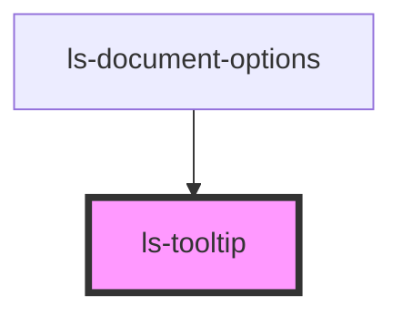

# ls-tooltip

<!-- Auto Generated Below -->

## Properties

| Property           | Attribute           | Description | Type                                     | Default     |
| ------------------ | ------------------- | ----------- | ---------------------------------------- | ----------- |
| `placement`        | `placement`         |             | `"bottom" \| "left" \| "right" \| "top"` | `'top'`     |
| `referenceElement` | `reference-element` |             | `HTMLElement`                            | `undefined` |

## Dependencies

### Used by

 - [ls-document-options](../ls-document-options)

### Graph

----------------------------------------------

*Built with [StencilJS](https://stenciljs.com/)*
