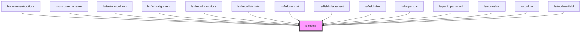

# ls-tooltip

<!-- Auto Generated Below -->

## Properties

| Property           | Attribute           | Description | Type                                     | Default     |
| ------------------ | ------------------- | ----------- | ---------------------------------------- | ----------- |
| `placement`        | `placement`         |             | `"bottom" \| "left" \| "right" \| "top"` | `'top'`     |
| `referenceElement` | `reference-element` |             | `HTMLElement`                            | `undefined` |
| `tooltipLocked`    | `tooltip-locked`    |             | `boolean`                                | `false`     |
| `tooltipText`      | `tooltip-text`      |             | `string`                                 | `undefined` |
| `tooltipTitle`     | `tooltip-title`     |             | `string`                                 | `undefined` |

## Methods

### `hide() => Promise<void>`

#### Returns

Type: `Promise<void>`

## Dependencies

### Used by

 - [ls-document-options](../ls-document-options)
 - [ls-document-viewer](../ls-document-viewer)
 - [ls-feature-column](../ls-feature-column)
 - [ls-field-alignment](../ls-field-alignment)
 - [ls-field-dimensions](../ls-field-dimensions)
 - [ls-field-distribute](../ls-field-distribute)
 - [ls-field-format](../ls-field-format)
 - [ls-field-placement](../ls-field-placement)
 - [ls-field-size](../ls-field-size)
 - [ls-helper-bar](../ls-helper-bar)
 - [ls-participant-card](../ls-participant-card)
 - [ls-statusbar](../ls-statusbar)
 - [ls-toolbar](../ls-toolbar)
 - [ls-toolbox-field](../ls-toolbox-field)

### Graph

----------------------------------------------

*Built with [StencilJS](https://stenciljs.com/)*
