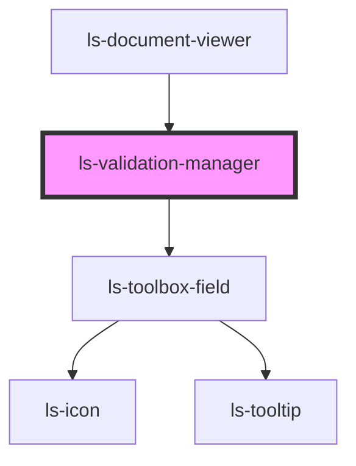

# ls-validation-manager

<!-- Auto Generated Below -->

## Properties

| Property           | Attribute           | Description                                         | Type                | Default     |
| ------------------ | ------------------- | --------------------------------------------------- | ------------------- | ----------- |
| `validationErrors` | `validation-errors` | The template information (as JSON). {LSApiTemplate} | `ValidationError[]` | `undefined` |

## Dependencies

### Used by

 - [ls-document-viewer](../ls-document-viewer)

### Depends on

- [ls-toolbox-field](../ls-toolbox-field)

### Graph

----------------------------------------------

*Built with [StencilJS](https://stenciljs.com/)*
