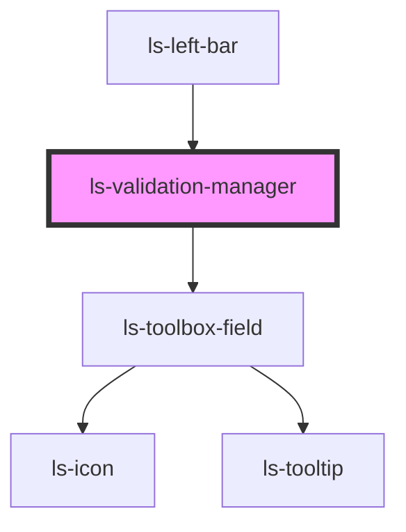

# ls-validation-manager

<!-- Auto Generated Below -->

## Properties

| Property           | Attribute | Description                                         | Type                | Default     |
| ------------------ | --------- | --------------------------------------------------- | ------------------- | ----------- |
| `validationErrors` | --        | The template information (as JSON). {LSApiTemplate} | `ValidationError[]` | `undefined` |

## Events

| Event          | Description | Type                          |
| -------------- | ----------- | ----------------------------- |
| `selectFields` |             | `CustomEvent<LSApiElement[]>` |

## Dependencies

### Used by

 - [ls-left-bar](../ls-left-bar)

### Depends on

- [ls-toolbox-field](../ls-toolbox-field)

### Graph

```mermaid
graph TD;
  ls-validation-manager --> ls-toolbox-field
  ls-toolbox-field --> ls-icon
  ls-toolbox-field --> ls-tooltip
  ls-left-bar --> ls-validation-manager
  style ls-validation-manager fill:#f9f,stroke:#333,stroke-width:4px
```

----------------------------------------------

*Built with [StencilJS](https://stenciljs.com/)*
